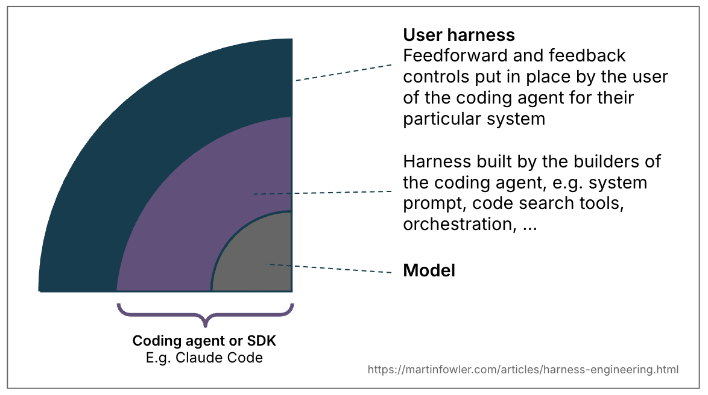
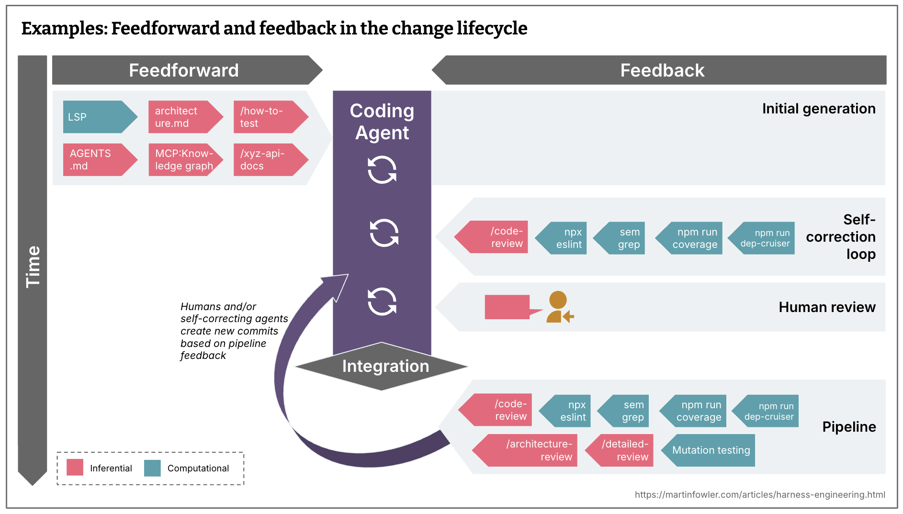
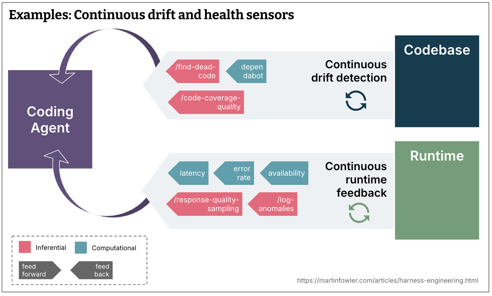

> [Birgitta Böckeler](https://birgitta.info/)가 작성한 [Harness engineering for coding agent users](https://martinfowler.com/articles/harness-engineering.html)를 번역하고, 설명을 돕기위해 일부 설명과 국내 사용 사례를 추가했습니다.

## Harness란?

<figure>
  
  <figcaption>출처: <a href="https://martinfowler.com/articles/harness-engineering.html">Harness engineering for coding agent users</a></figcaption>
</figure>

- 하네스라는 용어는 AI 에이전트에서 모델 자체를 제외한 모든 것을 의미하는 약어로 등장했다. 즉, AI 에이전트는 모델과 하네스의 조합이라는 뜻인데, 이는 매우 광범위한 정의이다.
- 코딩 에이전트에는 하네스의 일부가 이미 내장되어 있다.
  - ex) 시스템 프롬프트(에이전트의 역할, 작업 원칙, 도구 사용법, 금지 행동 등을 미리 지정), 선택된 코드 검색 메커니즘(저장소 전체를 모델에 넣을 수 없으므로, 현재 작업과 관련된 파일과 코드를 찾아 컨텍스트로 제공), [오케스트레이션 시스템](https://www.anthropic.com/engineering/effective-harnesses-for-long-running-agents)(여러 에이전트에게 작업을 나누거나, 실패 시 다시 시도하게 하는 것도 포함)
- 코딩 에이전트는 사용자에게 특정 사용 사례와 시스템에 맞는 외부 하네스를 구축할 수 있는 기능을 제공한다.

잘 설계된 외부 하네스는 2가지 목표를 달성한다. 궁극적으로 검토 작업량을 줄이고, 시스템 품질을 향상 시키고, 그 과정에서 토큰 낭비를 줄이는 부가적인 이점도 제공한다.

- 에이전트가 처음부터 올바른 결과를 도출할 확률을 높인다. (Feedforward, Guide)
  - Priciples, CfRs(검토할 때 중점적으로 확인해야 할 사항?), Rules, Ref Docs, How-tos, Language Servers, CLIs, scripts, Code mods
- 문제가 사람의 눈에 띄기 전에 최대한 많은 오류를 자체 수정하는 피드백 루프를 제공한다. (Feedback, Sensor)
  - Static Analysis, Review agents, Logs, Browser

## Feedforward와 Feedback

코딩 에이전트를 잘 활용하기 위해서, 원치 않은 출력을 예측하고 이를 방지하려고 노력하는 동시에 에이전트가 스스로 오류를 수정할 수 있도록 센서를 추가해야한다. (둘 중 하나만 적용하면, 같은 실수를 반복하는 에이전트와 규칙이 실제로 효과가 있었는지 확인하지 못하는 에이전트가 된다.)

- **Guide(feedforwad controls)** : 에이전트의 행동을 예측하고, 행동 이전에 에이전트를 유도하는 것을 목표로 한다. 이를 사용하면, 첫 시도에서 좋은 결과를 낼 확률이 높아진다.
- **Sensor(feedback controls)** : 에이전트의 동작 후를 관찰하고 자체 수정을 지원한다. LLM이 이해하기 좋은 형태로 신호를 제공하면 효과적이다. ex) 자체 수정 방법을 안내하는 사용자 정의 린터 메시지

## 계산형 vs 추론형

가이드와 센서에는 2가지 실행 유형이 있다. 꼭 1가지만 선택하는 것은 아니다. 신규 프로젝트를 부트 스트랩하기 위한 지침(스킬)은 추론형과 계산형을 모두 사용할 수 있다.

- **Computational** : 결정론적이고, 빠르며 CPU에서 실행된다. 테스트, 린터, 타입 검사기, 구조 분석이 이에 해당된다. 밀리초에서 수초 안에 실행된다. 결과를 신뢰할 수 있다.
  - 해당 유형의 가이드와 센서는 저렴하고 충분히 빠르기 때문에 매 변경마다 실행 가능하다. 결정론적인 도구를 활용해 좋은 결과가 나올 확률을 높인다.
  - 예시 :
    - **Code mods** : 계산형 가이드 ex) [OpenRewrite 레시피](https://devsh.tistory.com/entry/OpenRewrite-%EB%A7%88%EC%9D%B4%EA%B7%B8%EB%A0%88%EC%9D%B4%EC%85%98-%EA%B0%80%EC%9D%B4%EB%93%9C)에 접근할 수 있는 도구
    - **Structural Tests** : 계산형 센서 ex) ArchUnit + hook
- **Inferential** : 의미 분석, AI 코드 리뷰, 평가자로서의 LLM 등이 이에 해당된다. GPU나 NPU에서 실행되며, 느리고 비용이 많이 든다. 결과는 비결정적이기 때문에 실행할 때마다 달라질 수 있다.
  - 더 많은 비용이 들고 비결정적이지만, 풍부한 지침을 제공하고 의미적인 판단을 추가할 수 있게 해준다. 성능이 뛰어난 모델(해당 작업에 적합한 모델)과 함께 사용하면 결과에 대한 신뢰를 높힐 수 있다.
  - 예시 :
    - **Coding Conventions** : 추론형 가이드 ex) [AGENTS.md](http://agents.md/), skills
    - **Instructions how to review** : 추론형 센서 ex) skills

## 조종 루프(Steering Loop)

사용자의 역할은 하네스를 반복적으로 개선해 에이전트가 올바른 방향으로 나아가도록 조종하는 것이다. 같은 문제가 여러 번 발생한다면, 그 문제가 발생할 가능성을 낮추거나 완전히 방지할 수 있도록 피드포워드 및 피드백 제어를 개선해야 한다.

[조종 루프](https://aipatternbook.com/steering-loop)에서는 하네스를 개선하는 데 AI를 활용할 수 있다. 에이전트 덕분에 사용자 정의 제어와 정적 분석 도구를 적은 비용으로 만들 수 있다. 에이전트는 구조 테스트를 작성하고, 관찰된 패턴을 기반으로 규칙 초안을 생성하며, 사용자 정의 린터의 기본 구조를 만들거나, 코드베이스를 탐색, 분석하여 사용 방법을 안내하는 가이드를 작성하는 데 도움을 줄 수 있다.

## 품질 검증을 왼쪽으로 이동시키자

[지속적 통합](https://martinfowler.com/articles/continuousIntegration.html)을 수행하는 팀은 비용, 속도, 중요도에 따라 테스트와 검사, 사람의 리뷰를 개발 과정의 여러 단계에 적절히 배치해야하는 문제를 겪는다.

[지속적 전달](https://martinfowler.com/bliki/ContinuousDelivery.html)을 목표로 한다면, 이상적으로 모든 커밋이 배포 가능한 상태이기를 원할 것이다. 문제를 일찍 발견할수록 수정 비용이 적게 들기 때문에, 운영 환경으로 향하는 과정에서 가능한 왼쪽(개발 초기 단계)에 검사를 배치해야 한다.

새롭게 등장한 추론형 센서를 포함한 피드백 센서들도 이에 맞춰 전체 개발 생명주기에 적절하게 분산해야 한다.

<figure>
  
  <figcaption>출처: <a href="https://martinfowler.com/articles/harness-engineering.html">Harness engineering for coding agent users</a></figcaption>
</figure>

- 통합하기 이전, 커밋을 생성하기 전에도 실행할 수 있을 정도로 빠른 검사는 다음과 같다.
  - 린터, 빠른 테스트 스위트, 기본적인 코드 리뷰 에이전트
- 비용이 더 많이 들기 때문에 통합 이후 파이프라인에서만 실행해야하는 검사는 다음과 같다.
  - 변이 테스트, 넓은 맥락과 전체적인 관점을 고려하는 심층 코드 리뷰
  - 사람 또는 스스로 오류를 수정하는 에이전트가 파이프라인의 피드백을 바탕으로 새로운 커밋을 생성

지속적인 드리프트(continuous drift)는 코드베이스가 여러 번의 작은 변경을 거치면서 원래 의도한 구조와 품질 기준에서 서서히 벗어나는 현상이다.

<figure>
  
  <figcaption>출처: <a href="https://martinfowler.com/articles/harness-engineering.html">Harness engineering for coding agent users</a></figcaption>
</figure>

- 코드베이스를 지속적으로 검사하는 센서를 통해 점진적으로 누적되는 드리프트 모니터링 (Continuous drift detection)
  - 사용되지 않는 코드 탐지, 테스트 커버리지의 품질 분석, 의존성 스캐너
- 에이전트가 모니터링할 수 있는 런타임 피드백은 다음과 같다. (Continuous runtime feedback)
  - 악화되는 SLO를 감지하고 개선 방법을 제안
  - AI 평가자가 응답 품질을 지속적으로 샘플링
  - 로그의 이상 징후를 탐지하고 표시

## 제어 범주(Regulation categories)

하네스는 피드포워드와 피드백을 결합해 코드 베이스가 원하는 상태로 나아가도록 조절하는 사이버네틱 제어기처럼 동작한다. 이 목표 상태를 하네스가 무엇을 제어하는지에 따라 여러 차원으로 구분하는 것은 유용하다. 범주마다 하네스 구축 및 적용 난이도와 복잡도가 다르기 때문이다.

### 유지보수성 하네스(Maintainability harness)

코드 내부의 품질과 유지보수성을 제어하는 하네스 유형으며, 활용할 수 있는 기존 도구가 많기 때문에 가장 쉽게 구축할 수 있다.

계산형 센서는 다음과 같은 구조적 문제를 신뢰성 있게 발견한다. (저렴하고 검증됨)

- 중복 코드, 순환 복잡도, 테스트 커버리지 부족, 아키텍처 드리프트, 코드 스타일 위반

LLM은 다음과 같이 의미적 판단이 필요한 문제를 어느 정도 다룰 수 있다. (비싸고 확률적)

- 의미상 중복 코드, 불필요하거나 중복된 테스트, 근본 원인을 해결하지 않는 무차별적 수정, 지나치게 복잡하게 설계된 해결책

하지만, 다음과 같이 영향이 큰 문제를 안정적으로 발견하지는 못한다. 때로는 발견할 수도 있지만, 사람의 감독을 줄일 만큼 신뢰할 수 있는 수준은 아니다. 애초에 사람이 원하는 결과를 명확하게 설명하지 않았다면, 결과가 올바른지를 판단하는 것은 어떤 센서도 담당할 수 없는 영역이다.

- 문제의 원인을 잘못 진단하는 경우
- 과도한 설계와 불필요한 기능 추가
- 지시 사항을 잘못 이해하는 경우

### 아키텍처 적합성 하네스(Architecture fitness harness)

애플리케이션이 갖춰야 할 아키텍처 특성을 정의하고, 실제로 그 특성을 만족하는지 검사하는 가이드와 센서를 하나로 묶은 것이다. 기본적으로 [아키텍처 피트니스 함수(Architectural Fitness Function)](https://www.thoughtworks.com/en-de/radar/techniques/architectural-fitness-function)를 의미한다. 예시는 다음과 같다.

- 성능 요구 사항을 에이전트에게 미리 전달하는 스킬, 변경 이후 성능이 개선되거나 저하됐는지를 에이전트에게 피드백하는 성능 테스트
- 관측 가능성을 위한 코딩 규칙을 설명하는 스킬 ex) 로깅 표준
- 에이전트가 문제를 해결하는 과정에서 제공받은 로그의 품질이 충분했는지 스스로 평가하도록 요청하는 디버깅 지침

아키텍처 적합성 하네스는 에이전트가 기능만 동작하게 만드는 것이 아니라, 시스템이 요구하는 성능·구조·보안·관측 가능성 같은 아키텍처 품질까지 지키게 만드는 장치이다.

```text
가이드: “응답 시간은 p95 200ms 이하여야 한다”라고 미리 안내
                         ↓
                   에이전트가 구현
                         ↓
센서: 성능 테스트를 실행해 실제 응답 시간이 기준을 만족하는지 검사
```

### 동작 하네스(Behaviour harness)

애플리케이션이 우리가 원하는 대로 기능적으로 동작하는지를 어떻게 안내하고 감지할 수 있을까? 현재 코딩 에이전트에 높은 자율성을 부여하는 사람들은 대부분 다음과 같은 방식을 사용하는 것으로 보인다.

- **피드포워드** : 기능 명세를 에이전트에게 제공. 명세의 상세도는 짧은 프롬프트 ~ 여러 파일로 구성된 설명까지 다양
- **피드백** : AI가 생성한 테스트 스위트가 모두 통과하는지, 테스트 커버리지가 충분히 높은지 확인한다. 일부는 변이 테스트를 이용해 테스트 품질까지 확인하기도 한다. 이후에는 이 검사 결과를 수동 테스트와 결합한다.

하지만, 이는 AI가 생성한 테스트를 지나치게 신뢰한다는 문제가 있으며, 아직 충분하다고 보기 어렵다.

[승인된 픽스처(approved fixtures)](https://lexler.github.io/augmented-coding-patterns/patterns/approved-fixtures/) 패턴을 사용해 좋은 결과를 얻고 있는 사례가 있다. 그러나 이 패턴은 어떤 영역에서는 적용하기 쉽지만 다른 영역에서는 그렇지 않다. 따라서 적합한 곳에서 선별적으로 사용하고 있으며, 테스트 품질 문제 전체를 해결할 수 있는 포괄적인 해답은 아니다.

- 입력과 예상 결과를 읽기 쉬운 도메인별 픽스처로 만들고, 테스트 실행 후 생성된 결과와의 diff만 사람이 검토하여 AI가 만든 테스트를 빠르고 신뢰성 있게 검증하는 패턴이다.

결국 사람의 감독과 수동 테스트를 줄일 수 있을 만큼 높은 신뢰를 제공하는 기능적 동작 하네스를 만들기 위해서는 아직 해결해야 할 문제가 많이 남아 있다. (한계점)

## 하네스 적용 가능성(Harnessability)

모든 코드베이스가 하네스를 적용하기에 똑같이 적합한 것은 아니다.

정적 타입 언어로 작성된 코드베이스에서는 타입 검사가 자연스럽게 센서 역할을 한다. 모듈 경계가 명확하면 아키텍처 제약 규칙을 정의할 수 있다. Spring 같은 프레임워크는 에이전트가 신경 쓰지 않아도 되는 세부 사항을 추상화하기 때문에, 결과적으로 에이전트가 올바른 결과를 만들어낼 가능성을 암묵적으로 높인다.

반대로 코드베이스에 이러한 특성이 없다면, 그에 해당하는 제어 장치도 구축할 수 없다. 이는 신규 프로젝트와 레거시 프로젝트에서 서로 다르게 나타난다.

- 신규 프로젝트를 시작하는 팀은 첫날부터 하네스 적용 가능성을 시스템에 내재화할 수 있다. 어떤 기술과 아키텍처를 선택하느냐에 따라 코드베이스를 얼마나 효과적으로 통제하고 원하는 상태로 유도할 수 있는지가 결정된다.
- 반면 기술 부채가 많이 누적된 레거시 애플리케이션을 다루는 팀은 더 어려운 문제에 직면한다. 하네스가 가장 절실하게 필요한 곳일수록, 정작 하네스를 구축하기는 가장 어렵기 때문이다.

글 작성자의 동료인 네드 레처(Ned Letcher)는 에이전트 환경을 하네스하기 쉽게 만드는 특성을 환경 자체가 제공하는 조건(ambient affordances)이라고 부른다.(에이전트가 작업하는 환경을 이해하고 탐색하며 다루기 쉽게 만들어 주는, 환경 자체의 구조적 특성)

## 하네스 템플릿(Harness templates)

대부분의 기업에는 전체 요구사항의 80% 정도를 충족하는 몇 가지 공통적인 서비스 유형이 있다. 예를 들면 API를 통해 데이터를 제공하는 비즈니스 서비스, 이벤트 처리 서비스, 데이터 대시보드 등이 있다.

성숙한 엔지니어링 조직에서는 이러한 서비스 유형이 이미 서비스 템플릿으로 표준화되어 있는 경우가 많다. 앞으로 이러한 템플릿은 하네스 템플릿으로 발전할 수 있다. 하네스 템플릿은 코딩 에이전트가 특정 서비스 유형의 구조와 규칙, 기술 스택을 벗어나지 않도록 유도하는 가이드와 센서의 묶음이다.

앞으로 팀은 사용할 기술 스택과 시스템 구조를 선택할 때, 해당 기술과 구조에 이미 사용할 수 있는 하네스가 마련되어 있는지도 기준으로 고려하게 될 수 있다.

물론 서비스 템플릿에서 겪었던 것과 비슷한 문제도 마주하게 될 것이다. 팀이 템플릿을 가져와 사용하는 순간부터, 원본 템플릿의 개선 사항과 점차 동기화되지 않기 시작한다.

하네스 템플릿도 동일한 버전 관리와 변경 사항 반영 문제를 겪을 것이다. 특히 테스트하기 어려운 비결정적 가이드와 센서까지 포함하므로, 그 문제가 서비스 템플릿보다 더 심각할 수도 있다.

- 예를 들어 회사에서 Spring API 서버용 하네스 템플릿을 제공할 수 있다. 여기에는 표준 프로젝트 구조, 코딩 규칙, 테스트 방법, 아키텍처 검사, AI 작업 지침 등이 포함된다. 개발팀은 이를 활용해 에이전트가 회사의 개발 표준을 따르도록 만들 수 있다. → 각 팀이 템플릿을 가져간 뒤 자체적으로 수정하면 원본의 개선 사항을 계속 반영하기 어려워진다.

### 애슈비의 법칙(Ashby’s Law)

애슈비의 필요 다양성 법칙은 사전에 정의된 서비스 유형이 필요한 또 다른 흥미로운 근거다.

이 법칙에 따르면, 어떤 시스템을 제어하려는 제어 장치는 그 시스템이 가질 수 있는 경우의 수만큼 충분한 다양성을 갖춰야 한다. 또한 자신이 이해하고 모델링한 대상만 제어할 수 있다.

LLM 기반 코딩 에이전트는 거의 모든 형태의 코드를 만들어낼 수 있다. 하지만 특정 서비스 유형과 구조를 미리 선택하면 에이전트가 선택할 수 있는 범위가 줄어든다. 그만큼 해당 범위를 빠짐없이 관리하고 검증하는 하네스를 구축하기도 쉬워진다.

즉, 서비스 유형을 미리 정의하는 것은 시스템이 가질 수 있는 경우의 수를 줄여 하네스로 통제하기 쉽게 만드는 방법이다.

## 사람의 역할

> 좋은 하네스의 목표는 사람의 개입을 완전히 없애는 것이 아니라, 사람의 판단이 가장 중요한 곳에 집중되도록 만드는 것이어야 한다.

**개발자는 자신의 기술과 경험을 일종의 암묵적인 하네스로 활용하며 모든 코드베이스를 다룬다.**

- 우리는 관례와 좋은 개발 방식을 체득했고, 복잡한 코드가 얼마나 큰 인지적 부담을 주는지 경험했다.
- 커밋에 자신의 이름이 남는다는 책임감도 가지고 있다.

**개발자는 조직의 방향과 맥락을 이해하고 있다.**

- 팀이 무엇을 달성하려는지, 비즈니스상의 이유로 어떤 기술 부채를 허용하고 있는지, 이 조직과 코드베이스에서 무엇이 ‘좋은 결과’인지 알고 있다.

**개발자는 자신의 속도에 맞춰 작은 단계로 작업한다.**

- 작은 단계로 작업하면 그 과정에서 자신의 경험을 떠올리고 적용할 수 있는 생각의 여유가 생긴다.

**코딩 에이전트에게는 이러한 것이 없다.**

- 사회적인 책임감도 없고, 300줄짜리 함수를 보고 불쾌함을 느끼지도 않는다.
- “우리 팀에서는 이런 방식으로 개발하지 않는다”라는 직관이나 조직의 기억도 없다.
- 어떤 규칙이 시스템을 지탱하는 핵심 원칙이고 어떤 규칙이 단순한 습관인지 알지 못한다.
- 기술적으로 올바른 해결책이더라도 그것이 팀의 목표에 적합한지는 판단하기 어렵다.

하네스는 사람 개발자의 경험이 제공하던 암묵적인 판단 기준을 외부로 꺼내 명시적으로 만드는 시도다. 하지만 모든 경험과 판단을 완전히 옮길 수는 없다. 일관된 가이드와 센서, 자체 수정 피드백 루프를 구축하는 데는 많은 비용이 들기 때문에, 명확한 목표를 가지고 우선순위를 정해야 한다.

## 국내 하네스 엔지니어링 사례

| 기업·사례 | 구축 내용 | 하네스 관점 |
| --- | --- | --- |
| 네이버 — [AI 에이전트를 위한 Playwright E2E 테스트 하네스 구축하기](https://d2.naver.com/helloworld/6811215) | Playwright E2E 환경에서 에이전트가 테스트를 작성하고 직접 실행·검증하도록 구성 | Behaviour sensor, 자체 수정 루프 |
| 네이버 — [AI 에이전트가 코드를 실험하고 개선하는 법](https://d2.naver.com/helloworld/8061804) | 에이전트가 코드를 수정하고 빌드·실험·판정하는 9단계 루프와 회귀 방지 장치를 구축해 스트리밍 QoE를 17% 개선 | Architecture fitness sensor, 회귀 검사, 자동 수정 루프 |
| LG CNS — [DevOn AI-Driven Development](https://www.lgcns.com/kr/newsroom/press/detail.ko_0912) | 요구사항 분석부터 코드 생성, 테스트, 품질 검증까지 연결하고 실패하면 코드를 자동 수정해 다시 검증 | 기능 명세, 테스트 센서, 자체 수정 루프 |
| 카카오 — [AI 데브옵스 시스템, 카카오릴리즈](https://tech.kakao.com/posts/742) | GitHub·Jira·인수 조건·과거 장애를 수집해 배포 문서를 만들고 정책과 위험도를 검토하며 배포 후 24시간 모니터링 | 조직 지식, 배포 규칙, 운영 센서, 피드백 루프 |
| 토스 — [AI-driven UI 테스트 자동화](https://toss.tech/article/ai-driven-ui-test-automation) | 프로젝트 가이드와 35개 E2E 시나리오를 제공하고, 실패 로그·스크린샷을 AI가 분석해 수정안을 제시한 뒤 재실행 | Behaviour sensor, 사람을 포함한 수정 루프 |
| 우아한형제들 — [하네스 엔지니어링으로 팀 맞춤형 AI 환경 구축하기](https://techblog.woowahan.com/26177/) | Cursor Rules에 팀 규칙을 정의하고 Skills로 API·테스트·PR 생성 작업을 표준화. 전처리 스크립트로 필요한 컨텍스트만 제공 | 명시적인 하네스 사례, feed-forward 중심 |
| 토스 — [Skill 품질 관리를 위한 Rub릭 설계와 시스템 구현](https://toss.tech/article/skill-quality-rubric) | 사내 공용 Skill을 17개 규칙 검사와 13개 LLM 검사로 평가하고, 심각한 결함은 PR 병합 차단 | 하네스 자체를 관리하는 메타 하네스 |
| 카카오 — [에이전틱 코딩 가이드북과 표준 룰셋 공유 시스템](https://tech.kakao.com/posts/756) | 코딩 컨벤션과 보안 정책, AI 협업 방법을 가이드북·치트시트·표준 룰셋으로 만들어 전사 공유 | 조직 공통 feed-forward guide |
| 카카오 — [AI 기반 정적 분석 기술](https://tech.kakao.com/posts/732) | 복잡도·보안·버그 패턴을 규칙 기반 분석과 LLM으로 검사하고, 위험도에 따라 PR 경고나 배포 차단 가능 | Computational·Inferential sensor |
| 카카오 — [단위 테스트 자동 생성을 통한 코드 품질 향상](https://tech.kakao.com/posts/733) | 의존성을 분석해 테스트를 생성하고 컴파일러, JUnit, JaCoCo로 검증한 뒤 PR에 제안 | 테스트 생성, 컴파일·실행·커버리지 센서 |
| 카카오 — [TestLAB AI를 이용한 API 테스트 자동화](https://tech.kakao.com/posts/736) | OpenAPI·Postman·실제 응답과 자연어 검증 조건을 바탕으로 assertion을 생성하고 CI에서 실행 | API Behaviour sensor |
| 카카오 — [DeviceFarm AI를 사용한 QA 테스트 자동화](https://tech.kakao.com/posts/737) | 자연어 QA 시나리오와 성공 조건을 받아 실제 단말을 조작하고 접근성 정보·스크린샷으로 결과 판단 | UI Behaviour sensor |
| 카카오 — [분산 추적 기반 AI 운영 생태계](https://tech.kakao.com/posts/747) | 성능·오류·로그를 모니터링해 원인을 분석하고, 배포 전후 상태를 추적. 수집 정보를 이용한 코드 수정과 PR 생성은 확장 계획 | Continuous runtime sensor |
| 카카오 — [Code Buddy와 Matrix AI](https://tech.kakao.com/posts/655) | Code Buddy가 PR을 요약·리뷰하고, Matrix AI가 서비스 이상과 과거 유사 장애를 분석 | 코드 리뷰 센서와 런타임 센서 |
| 네이버 — [LLM을 이용한 AI 코드 리뷰 도입기](https://d2.naver.com/helloworld/7321313) | 사내 GitHub 환경에 LLM 기반 자동 코드 리뷰 도구를 연결 | Inferential code-review sensor |
| 네이버 — [사람과 AI Agent를 위한 통합 Context Provider 구축](https://d2.naver.com/helloworld/7056385) | 팀의 데이터·서빙 자산을 자동 수집해 에이전트가 필요한 맥락을 일관되게 제공 | 컨텍스트 기반 feed-forward control |
| 토스 — [토스 QA 플랫폼과 tcgen](https://toss.tech/article/50893) | PRD·디자인 문서·제품 맥락으로 테스트 케이스를 만들고, PR 영향 분석·스모크·회귀·크래시 검사를 연결 | 기능 명세와 Behaviour sensor |
| 우아한형제들 — [AI와 함께하는 테스트 자동화 플러그인 개발기](https://techblog.woowahan.com/24568/) | IntelliJ 플러그인이 컴파일 가능한 테스트 골격을 만들고 Amazon Q가 구현을 채우며 컴파일과 테스트로 검증 | 결정적 템플릿과 테스트 센서 |
| 우아한형제들 — [시스템 맥락을 가진 디자인 시스템 챗봇](https://techblog.woowahan.com/26319/) | 디자인 의도, 컴포넌트 이력, 가이드와 코드베이스를 검색해 UI 코드 생성에 필요한 맥락 제공 | 도메인·아키텍처 feed-forward control |
| 삼성전자 — [사내용 AI 코딩 어시스턴트 code.i](https://news.samsung.com/kr/%EC%82%BC%EC%84%B1%EC%A0%84%EC%9E%90-%EC%82%BC%EC%84%B1-ai-%ED%8F%AC%EB%9F%BC%EC%84%9C-%EC%9E%90%EC%B2%B4-%EA%B0%9C%EB%B0%9C-%EC%83%9D%EC%84%B1%ED%98%95-ai-%EC%82%BC%EC%84%B1-%EA%B0%80) | 사내 개발 환경에 맞춘 코드 설명과 테스트 케이스 생성 기능 제공 | 조직 특화 코딩 도구와 테스트 생성 |
| 네이버 — [스펙 기반 답변 생성 모델 자동화 파이프라인](https://d2.naver.com/helloworld/2852215) | 스펙이 바뀌면 결함 탐지, 프롬프트 최적화, SFT 데이터 생성을 폐쇄 루프로 실행 | 코딩 하네스는 아니지만 명세 기반 자체 개선 루프 |
| 네이버 — [AI 에이전트 자율 성장 프레임워크 GNOSIS](https://d2.naver.com/helloworld/4399330) | Constitution, 3개 루프, 5층 기억 구조를 이용해 세션 간 경험을 축적 | 일반 에이전트용 규칙·기억·자체 개선 하네스 |
| 마이리얼트립 — [1년간의 AI 코딩 여정: 손으로 치던 코드에서 에이전트가 쓰는 코드까지](https://medium.com/myrealtrip-product/1%EB%85%84%EA%B0%84%EC%9D%98-ai-%EC%BD%94%EB%94%A9-%EC%97%AC%EC%A0%95-%EC%86%90%EC%9C%BC%EB%A1%9C-%EC%B9%98%EB%8D%98-%EC%BD%94%EB%93%9C%EC%97%90%EC%84%9C-%EC%97%90%EC%9D%B4%EC%A0%84%ED%8A%B8%EA%B0%80-%EC%93%B0%EB%8A%94-%EC%BD%94%EB%93%9C%EA%B9%8C%EC%A7%80-30a9d2a1d3f3) | 프로젝트·도메인·작업으로 구분한 3계층 컨텍스트와 문서 인덱싱 플러그인, 테스트 통과 조건을 구축 | 명시적인 하네스 사례, 컨텍스트·테스트 센서 |
| LINE NEXT — [조직 전반의 코드 품질을 지키는 AI 코드 리뷰 플랫폼화](https://techblog.lycorp.co.jp/ko/building-ai-code-review-platform-with-claude-code-action) | Claude Code Action을 조직 공통 GitHub Actions 플랫폼으로 구축하고 중앙 저장소에서 권한·프롬프트·리뷰 정책을 관리 | 조직 공통 inferential sensor, 하네스 템플릿 |
| 무신사 — [무신사의 AI 코드 리뷰 프로세스 구축기](https://www.velopers.kr/post/6366) | Claude Code Action 기반 리뷰 로직과 프롬프트를 Composite Action으로 캡슐화하고 버전별로 배포 | Inferential code-review sensor, 재사용 가능한 하네스 템플릿 |
| 여기어때 — [AI 코딩 에이전트에게 사고 과정을 설계하다](https://techblog.gccompany.co.kr/ai-%EC%BD%94%EB%94%A9-%EC%97%90%EC%9D%B4%EC%A0%84%ED%8A%B8%EC%97%90%EA%B2%8C-%EC%82%AC%EA%B3%A0-%EA%B3%BC%EC%A0%95%EC%9D%84-%EC%84%A4%EA%B3%84%ED%95%98%EB%8B%A4-9c7325e4655d) | 에이전트의 작업 절차와 팀 규칙을 `.claude`에 계층화하고 `/start`, `/done`, 전문 에이전트, 정책 테스트를 결합 | Workflow guide, 품질 게이트, 자체 수정 루프 |
| KT Cloud — [AI 에이전트의 안전벨트, 하네스 엔지니어링](https://www.velopers.kr/post/8008) | Claude Code가 Terraform 코드를 안전하게 수정하도록 상태 머신, 권한 분리, Terraform MCP, 정적 분석과 사람의 최종 승인을 결합 | Architecture fitness harness, computational sensor, Human-in-the-loop |
| 토스 — [Harness를 통한 조직 생산성 저점 높이기](https://toss.tech/article/45519) | 조직의 린트·Git·테스트 정책을 Claude Code 플러그인으로 패키징하고 사내 마켓플레이스를 통해 배포 | 조직 공통 feed-forward guide, 하네스 템플릿 |
| 컬리 — [Claude Code를 활용한 예측 가능한 바이브 코딩 전략](https://helloworld.kurly.com/blog/vibe-coding-with-claude-code/) | Plan Mode, 서브 에이전트, `CLAUDE.md`, Agent Skills로 계획·규칙 확인·작업 분리를 체계화 | 컨텍스트 기반 feed-forward control, 오케스트레이션 |
| SK AX — [GitHub Spec Kit을 활용한 명세 기반 개발 프로세스](https://devocean.sk.com/blog/techBoardDetail.do?id=168103) | 기능 명세를 SSOT로 관리하고 명세를 기준으로 계획·구현·검증하는 개발 흐름을 구성 | 기능 명세 기반 feed-forward guide |
| 딜라이트룸 — [AI로 우리 회사 인프라 코드 완벽 관리하기](https://www.velopers.kr/post/6367) | Claude Code가 Pulumi 드리프트를 수정하도록 운영 리소스 변경 금지, 스택 격리, 사람의 확인, `pulumi preview` 검증을 적용 | Architecture fitness harness, 안전 규칙, computational sensor |
| 포스타입 — [AI 코드 리뷰, 3번 갈아엎고 배운 것](https://www.velopers.kr/post/8050) | AI 리뷰 범위를 버그·보안·성능·문서화된 규칙으로 제한하고 반복되는 오탐을 바탕으로 프롬프트와 리뷰 기준을 개선 | Inferential sensor, 사람이 하네스를 개선하는 steering loop |
| 토스 — [LLM은 똑똑한데, 왜 우리 회사 일은 모를까](https://toss.tech/article/llm_context_topic) | 문서·코드·사내 메신저를 공통 컨텍스트로 연결하고 출처·최신성·충돌·근거를 규칙 검사와 LLM 검증, 사람 승인으로 관리 | 컨텍스트 기반 feed-forward control, Computational·Inferential sensor, Human-in-the-loop |
