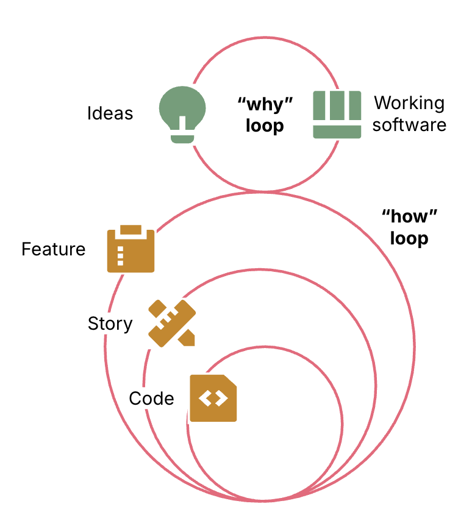
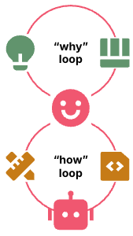

> [Kief Morris](https://kief.com/)의 [Humans and Agents in Software Engineering Loops](https://martinfowler.com/articles/exploring-gen-ai/humans-and-agents.html)를 번역하고, 제 생각을 추가한 글입니다.

## 들어가는 말

**소프트웨어 개발 과정에서 개발자는 아이디어를 결과물로 구현하는 목표에 집중하는 것이 중요**하다. 개발자는 에이전트가 알아서 하도록 내버려두거나 결과물을 세세하게 간섭하는 것이 아니라, **개발 과정 전체를 구축하고 관리**하는 것이다. (on the loop)

**소프트웨어 개발자로서 우리는 아이디어를 실제로 작동하는 소프트웨어로 구현하고, 발전시키면서 반복적으로 개선해 나가는 과정을 통해 결과물**을 만들어낸다. 이것이 why loop다. (AI가 더욱 발전되기 전까지 인간이 이 루프를 운영할 것이다. 결과물을 원하는 주체가 우리기 때문이다.)

**소프트웨어를 구축하는 과정은 how loop**이다. 여기서는 코드, 테스트, 도구, 인프라와 같은 중간 산출물을 만들고, 선택하고, 활용한다. ADR과 같은 문서도 포함된다. 우리는 이 중 상당수를 최종 결과물로 여기지만, 사실 중간 산출물은 목적을 달성하기 위한 수단일 뿐이다.

<figure>
  
</figure>

- **why loop** = 아이디어 ↔ 동작하는 소프트웨어
  - 아이디어와 소프트웨어를 오가면서 반복된다.
- **how loop** = 중간 산출문 ↔ specs, code, test, etc
  - 소프트웨어를 구축하는 과정을 반복한다.
  - 여러 루프로 이루어져 있다.
    - 가장 바깥쪽의 how loop는 why loop에 제공할 소프트웨어 명세를 정하고 완성한다.
    - 안쪽의 how loop는 코드를 생성하고 테스트한다.
    - 그 사이에 존재하는 how loop들은 상위 수준의 작업을 더 작은 작업으로 나눠 하위 loop가 구현하도록 하고, 결과를 검증한다.

## 루프 밖에 사람(Humans outside the loop)

많은 사람들은 why loop에 집중하고, how loop는 에이전트에게 맡기는 데 오는 즐거움을 발견했다. 일반적으로 이를 바이브 코딩이라고 한다. 사람은 원하는 결과를 작성하는 데 노력을 기울이되, LLM이 결과를 어떤 방식으로 달성해야 하는지는 지시하지 않는다.

- why loop = 사람이 운영
- how loop = 에이전트가 운영

우리가 진정으로 중요하게 여기는 것은 why loop이다. 소프트웨어 개발은 본질적으로 복잡하고 혼란스러운 영역이고, 과도하게 설계된 프로세스와 기술 부채를 처리하는 일에 발목을 잡히곤 한다. 뿐만 아니라, 새로운 LLM 모델이 *나*올때마다 사용자의 프롬프트를 받아 실제로 작동하는 소프트웨어를 만들어내는 능력이 향상됐다.

### 중요한 것은 외부 품질이다.

우리가 중요하게 여기는건 외부 품질이지, 내부 품질 그 자체가 아니다. **외부 품질은 소프트웨어의 사용자나 그 밖의 이해관계자가 직접 경험하는 품질**이다.

- 기능적 품질은 필수다.
- 시스템은 올바르게 작동해야 한다.
- 프로덕션 소프트웨어라면 비기능적 운영적 품질도 중요하다.
- 시스템은 장애를 일으키지 않고 빠르게 작동해야 한다.
- 기밀 데이터를 소셜 미디어 사이트에 게시해서도 안된다.
- 막대한 클라우드 호스팅 비용이 발생하는 것도 원치 않는다.
- 많은 분야에서도 규정 준수 감사도 통과해야 한다.

### 내부 품질이 중요한 경우도 있다.

> 내부 품질은 그 자체가 목적이라서 중요한 것이 아니다. **우리가 원하는 외부 결과를 더 빠르고 안정적이며 적은 비용으로 달성하게 해주기 때문에 중요하다.**

내부 품질이 외부 결과에 영향을 미칠 떄는 내부 품질도 중요하다. 사람 개발자가 코드베이스를 살피고, 기능을 추가하고 버그를 수정하던 시절에는 코드베이스가 깔끔할수록 더 빠르고 안정적으로 작업할 수 있었다.

이론적으로 LLM 에이전트는 복잡한 스파게티 코드베이스에서도 시행착오를 겪은 끝에 목표에 도달할 것이다. 하지만, **현실에서는 깔끔하게 설계되고 체계적으로 구조화된 코드베이스가 엉망인 코드베이스보다 외부 결과에도 중요한 이점을 제공**한다.

- LLM이 자신이 다루는 코드를 더 빠르게 이해하고, 수정할 수 있으면 작업 속도도 빨리지고, 결과를 잃고 악순환에 빠지는 일도 줄어든다.
- 우리에게 필요한 시스템을 구축하는 데 드는 시간과 비용은 분명히 중요하다.

## 루프 안의 사람(Humans in the loop)

> 일부 개발자는 내부 품질을 위해 how loop의 낮은 단계까지 관여해야 한다고 생각한다. 에이전트가 문제가 있는 코드를 붙잡고 헤매는 동안, 개발자는 몇 초만에 문제를 이해하고 해결하는 경우가 많다. 여전히 많은 상황에서 인간의 경험과 판단력이 LLM보다 뛰어나다.

코드가 생성되는 가장 안쪽 루프에서 인간이 승인자 역할을 하는 방식을 일반적으로Humans in the loop라고 한다. ex) LLM이 생성한 코드를 인간이 한 줄씩 직접 검토

- 이 과정을 지나치게 깊이 관여하면 병목이 된다.
- 에이전트가 코드를 생성하는 속도는 사람의 검토 속도보다 빠르다.
- LLM을 통해 코드 생성 시간을 절약한 만큼, 그보다 더 많은 시간을 인간이 명세 작성과 코드 검토에 사용하기 떄문에 생산성이 오르지 않을 수 있다.

**시프트 레프트(shift left) 사고 방식**을 적용해야 한다. 과거에는 개발자가 코드 작성 → QA → 뒤늦게 버그를 수정하고 출시의 흐름이었는데, 개발자가 직접 테스트를 작성하고 실행하면 문제를 즉시 발견하고 수정할 수 있으며, 전체 과정이 더 빠르고 안정적으로 진행된다는 사실을 알게 되었다.

**에이전트가 생성한 코드를 인간이 대신 검사해 주기만을 기다리는 것보다, 에이전트 스스로 결과물의 품질을 평가할 수 있을 때 더 좋은 코드를 만들어낸다.** (이를 위해 우리가 원하는 품질이 무엇인지 명확히 알려주고, 그것을 달성하는 가장 좋은 방법도 안내해야 한다.)

## 루프 위에 사람(Humans on the loop)

에이전트가 만들어낸 결과물을 인간이 직접 검사하는 대신, 에이전트가 더 좋은 결과물을 만들어내도록 할 수 있다. how loop안의 여러 단계의 루프를 제어하는 명세, 품질 검사, 작업 흐름 지침의 집합을 에이전트의 하네스라고 한다. 이 **하네스를 구축하고 유지하는 실천 방식인 하네스 엔지니어링이 humans on the loop에서 일하는 방식**이다.

<figure>
  
</figure>

- why loop = 사람이 운영
- how loop = 사람이 정의하고, 에이전트가 실행한다.

in the loop와 on the loop의 차이는 에이전트가 만든 결과물이나 중간 산출물이 만족스럽지 않을 때 대응하는 방식에서 분명하게 드러난다.

- **in the loop** : 산출물은 직접 편집하거나 에이전트에게 원하는 수정을 지시해 산출물 자체를 바로잡는다.
- **on the loop** : 산출물을 만들어낸 하네스를 개선해, 앞으로 우리가 원하는 결과를 만들어내도록 한다. 하네스를 지속적으로 개선함으로써 얻어지는 결과의 품질도 계속해서 높일 수 있다.

## 에이전틱 플라이휠(The Agentic Flywheel)

다음 단계는 인간이 하네스를 관리하고 개선하는 대신, 에이전트가 그 일을 수행하도록 지시하는 것이다. (사람은 how loop를 에이전트가 구축하고 개선하도록 지시한다.)

- 에이전트가 루프의 성과를 평가하는 데 필요한 정보를 제공해 플라이휠을 구축한다. (풍부한 신호를 제공할수록 강력해진다.)
  - 프로덕션 운영 데이터, 사용자 여정 로그, 사업 성과를 제공하면 에이전트가 분석할 수 있는 범위와 깊이가 넓어진다.
- 하네스에 이미 포함된 테스트와 평가 체계가 좋은 출발점이다.
- 성능을 측정하고 장애 상황을 검증하는 단계를 파이프라인에 추가할 수 있다.

워크플로의 각 단계에서 에이전트가 결과를 검토하고 하네스의 개선 방안을 제안하게 한다. (해당 결과를 개선할 수 있는 워크플로 상류의 모든 요소가 개선 대상에 포함)

처음에는 에이전트가 제안한 권고안을 인간이 하나씩 검토 → 구체적인 변경 사항을 구현하도록 에이전트에게 지시한다. 에이전트가 자신의 권고안을 제품 백로그에 추가하도록 할 수도 있다. 그러면, 권고안의 우선순위와 일정을 정하고, 에이전트가 자동화된 흐름 안에서 이를 선택해 적용하고 테스트하게 할 수 있다.

이후 신뢰가 쌓이면 에이전트가 위험, 비용, 편익을 고려해 권고안에 점수를 매기게 할 수 있으며, 일정한 점수 기준을 충족하는 권고안은 자동으로 승인하고 적용하도록 결정할 수 있다.

→ 어느 시점에 도달하면 이 방식은 바이브 코딩과 비슷해 보일 수 있다. 개선 루프의 효과가 점차 줄어드는 단계에 이르면, 자주 반복되는 표준적인 작업에서는 실제로 그렇게 될 가능성이 높다고 생각한다. 하지만, 하네스를 체계적으로 설계하면 일회성의 그럭저럭 괜찮은 해결책에 그치지 않는다. → **지속적으로 스스로를 개선하는 견고한 시스템, 혹은 변화와 충격을 통해 오히려 더 강해지는 안티프래질 시스템까지 얻을 수 있다.**

정리하자면, **에이전트가 만든 결과물뿐만 아니라, 결과물을 만드는 방식까지 에이전트가 개선하게 만들자는 것**이 핵심

처음부터 모든 것을 자동화하는 것은 아니고, 인간의 신뢰가 쌓이는 정도에 따라 자동화 수준을 단계적으로 높인다.

- 초기: 에이전트가 개선안을 제안하고 인간이 검토·승인한다.
- 중간: 개선안을 백로그에 넣고 우선순위에 따라 처리한다.
- 이후: 에이전트가 위험·비용·효과를 평가해 점수를 매긴다.
- 최종: 기준을 충족하는 개선안은 자동으로 승인·적용·검증한다.

바이브 코딩처럼 보일 수 있지만, 중요한 차이가 있다.

- 바이브 코딩: 에이전트에게 맡기고 결과가 나오기를 기대한다.
- 에이전틱 플라이휠: 인간이 평가 기준과 피드백 구조를 설계하고, 그 안에서 에이전트가 지속적으로 개선하게 한다. 결국 on the loop 방식의 진화 단계인듯?

## 우리는 어디로 가야하는가?

> 본문에는 나오지 않은 제 개인 생각입니다.

AI가 일자리를 대체할지 고민하기보다, AI를 잘 활용하는 방법을 익히는 것이 더 중요하다고 생각한다. 일자리의 변화는 개인이 통제하기 어렵지만, AI 활용 능력을 높이는 것은 통제할 수 있기 때문이다. 높아진 생산성을 바탕으로 이전보다 더 크고 어려운 문제를 해결할 수도 있다.

다만 AI가 생성한 모든 코드를 인간이 한 줄씩 검토한다면, 인간이 다시 병목이 되어 AI의 생산성을 충분히 활용하기 어렵다. 그렇다고 에이전트에게 모든 것을 맡겨야 한다는 뜻은 아니다. 개별 결과물을 매번 검사하고 수정하는 in the loop에만 머무르지 않고, 에이전트가 좋은 결과를 반복적으로 만들도록 명세, 테스트, 평가 기준과 작업 흐름을 설계하는 on the loop 방식도 익혀야 한다.

두 방식은 서로를 대체하지 않는다고 생각한다. 반복적이고 충분히 검증 가능한 작업에서는 인간이 on the loop에서 작업 시스템을 관리할 수 있다. 반면 위험하거나 불확실한 작업, 에이전트가 해결하지 못하는 문제에는 다시 in the loop로 들어가야 한다.

이 과정에서 에이전트의 결과를 판단하고 문제에 직접 개입하려면 전통적인 프로그래밍 지식이 필요하다. 또한 무엇을 테스트하고 어떤 제약을 둘 것인지 결정하려면 소프트웨어에 대한 이해와 경험이 있어야 한다. 인간의 개입에서 얻은 지식을 다시 하네스에 축적하면, 에이전트는 다음부터 같은 문제를 더 잘 처리할 수 있다.

따라서 전통적인 프로그래밍 공부의 목적은 사라지는 것이 아니라 달라진다고 생각한다. 모든 코드를 직접 작성하기 위해서가 아니라, 에이전트의 결과를 판단하고 더 좋은 결과를 만드는 시스템을 설계하기 위해 필요하다.

현재로서는 필요한 역량을 다음과 같이 정리할 수 있다.

- why loop = 도메인 이해 + 사용자·비즈니스 관점 + 문제 정의와 우선순위
- how loop + agentic flywheel = 전통적인 프로그래밍 지식 + AI 활용 능력

결국 AI 시대의 개발자에게 필요한 것은 in the loop와 on the loop 사이를 적절히 오가며, 인간의 판단을 반복 가능한 시스템의 역량으로 전환하는 능력이라고 생각한다.
