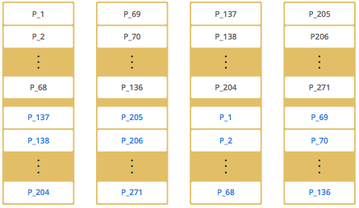

## Redis 대신 Hazelcast를 선택할 수 있는 근거

Redis를 사용한다면 EC2 한 대 정도는 더 사용할 수 있다고 판단했다. 다만 이 경우 standalone 구성이 되기 때문에 SPOF가 염려됐다.

Redis를 HA 구성으로 운영하려면 Sentinel 또는 Cluster 구성을 위한 추가 인스턴스를 운영해야 한다. 단순한 전역 상태 저장소 하나를 위해 Redis HA 구성까지 운영하는 것은 과하다고 판단했다.

반면 Hazelcast는 기존 애플리케이션 프로세스 안에서 embedded member로 실행할 수 있다. 각 JVM 프로세스에 Hazelcast 멤버를 추가하면 멤버끼리 클러스터링하여 고가용성과 내결함성을 가진 전역 상태 저장소를 만들 수 있다. Hazelcast embedded mode는 실행 중인 JVM의 메모리를 사용한다.

Redis와 비교하면 다음과 같이 볼 수 있다.

- Redis standalone은 단순하지만 SPOF가 된다.
- Redis HA 구성을 하려면 Sentinel 또는 Cluster 구성이 필요하다.
- Redis Cluster도 HA를 위해 replica 프로세스가 필요하다.
- Hazelcast embedded mode는 애플리케이션 프로세스가 확장될 때 함께 확장할 수 있다.
- Hazelcast는 별도 저장소 인프라를 크게 늘리지 않고 클러스터 구성이 가능하다.
- 대신 애플리케이션 JVM의 메모리와 GC 영향을 같이 고려해야 한다.

## 고가용성과 내결함성

Hazelcast는 스토리지 데이터, 연산 데이터, 백업을 모든 클러스터 멤버에 분산한다. 멤버가 손실되더라도 Hazelcast가 백업 데이터를 복원하여 지속적인 가용성을 제공할 수 있다.

백업은 메모리에 분산되어 저장된다. 분산은 파티션 수준에서 이루어지며, 기본 데이터와 백업은 각 파티션에 저장된다.

클러스터의 멤버가 손실되면 Hazelcast는 나머지 멤버에 백업을 재분배하여 모든 파티션에 백업을 저장한다. 이를 통해 데이터 손실에 대한 복원력을 확보할 수 있다. 백업 횟수는 구성 가능하며, 구성에 따라 파티션의 여러 복제본에 데이터를 보관할 수 있다.

Hazelcast에서는 클러스터 멤버가 서로의 상태를 모니터링한다. 네트워크 장애와 같은 이벤트로 인해 클러스터 멤버에 접근할 수 없게 되면 다른 멤버들이 협력하여 상태를 진단하고, 장애가 발생한 멤버의 작업을 인계받는다.

멤버가 접근할 수 없거나 작동이 중단되었는지 확인하기 위해 Hazelcast는 내장 장애 감지기를 제공한다.

## AP 데이터 구조를 위한 Replication

각 데이터 엔트리는 하나의 Hazelcast 파티션에 매핑되고, 그 파티션의 replica에 저장된다. replica 중 하나가 primary replica로 선출되어 해당 파티션의 연산을 담당한다.

데이터 엔트리를 읽거나 쓸 때 사용자는 해당 파티션의 primary replica가 할당된 Hazelcast 멤버와 통신한다. 즉 정상 상황에서는 각 요청이 데이터 엔트리의 최신 버전에 접근할 수 있다.

backup replica는 primary replica가 장애가 날 때까지 대기 상태를 유지한다. primary replica에 장애가 발생하면 backup replica 중 하나가 primary 역할로 승격된다.

지연 복제(lazy replication)에서는 primary replica가 어떤 키에 대한 업데이트 연산을 받으면 로컬에서 먼저 실행하고 backup replica에 전파한다. 업데이트에는 타임스탬프가 있어서 순서를 보장한다.

backup replication에는 동기 방식과 비동기 방식이 있다.

- 동기 : backup replica가 backup update를 적용하고 ack를 호출자에게 돌려줄 때까지 호출자를 블로킹한다.
- 비동기 : 전송만 하고 기다리지 않는다.

동기 방식에서도 실행 결과가 먼저 호출자에게 응답으로 전달되고, 호출자는 그 응답을 받은 다음 설정된 동기 백업 수만큼 ack를 사전에 정의된 timeout 안에서 기다린다. 기본 timeout은 5초다.

backup update는 오래된 파티션 테이블 정보, 네트워크 중단, 멤버 crash 등으로 누락될 수 있다.

- 부정확한 파티션 정보로 인해 backup replica를 가진 멤버에 update 요청을 하지 못할 수 있다.
- 네트워크 중단으로 update를 보내지 못할 수 있다.
- update를 보낼 멤버가 죽었을 수 있다.

결론적으로 동기 backup ack 대기에는 timeout이 필요하다.

동기든 비동기든 관계없이 backup update가 누락되면, 주기적으로 실행되는 anti-entropy 메커니즘이 불일치를 감지하여 backup replica를 primary와 동기화한다.

anti-entropy는 분산 시스템에서 업데이트 내역이 모든 노드에 전파되지 않아 엔트로피가 올라가는 상황을 다시 질서 있게 만드는 메커니즘이라고 이해했다.

## 분할과 복제

기본적으로 Hazelcast는 하나의 파티션에 대해 하나의 backup replica를 생성한다. 파티션에 여러 replica가 생성되도록 설정할 수도 있다. `backup-count`는 최대 6까지 설정할 수 있고, 설정한 backup count만큼 동시 장애를 허용한다. 그 이상 장애가 발생하면 데이터 유실이 발생할 수 있다.

  

특정 데이터 항목을 읽고 사용할 때는 해당 데이터 항목을 포함하는 파티션 owner와 통신한다. 파티션이 보유 가능한 데이터 항목의 양은 시스템의 물리적 용량에 따라 제한된다.

새로운 멤버가 합류하면 기본 파티션과 백업 파티션 일부를 새 멤버로 이동한다. Hazelcast는 파티션을 균등하게 분배한다.

Hazelcast는 해싱 알고리즘을 통해 데이터 항목을 파티션에 분배한다.

- 키를 직렬화하여 byte array로 변환한다.
- 변환된 byte array를 hash한다.
- hash 결과를 파티션 수로 modulo 연산한다.
- `MOD(hash result, partition count)` 결과가 partition id가 된다.

partition table에는 partition id와 파티션이 속한 클러스터 멤버의 주소가 저장된다. 클러스터의 모든 멤버가 이 정보를 알고 있어야 각 멤버가 데이터의 위치를 알 수 있다.

클러스터에서 가장 오래된 멤버, 즉 master member가 최초에 partition table을 생성한다. 새로운 멤버가 생길 때마다 partition table을 업데이트하고, 주기적으로 다른 모든 멤버에게 partition table을 전달한다. 기본 전송 간격은 15초이며 설정 가능하다.

master member가 다운되면 다음으로 오래된 멤버가 partition table 정보를 다른 멤버에게 전송한다.

리밸런싱은 클러스터에 멤버가 가입하거나 탈퇴하는 경우에 발생한다.

## Consistency 문제

Hazelcast는 backup partition을 운영하지만, 기본적으로 primary partition을 통해 조회와 변경이 이루어진다. 따라서 정상 상황에서는 일관성 문제가 발생하지 않는 것으로 이해했다.

다만 몇 가지 시나리오에서는 일관성이 깨질 수 있다.

첫 번째는 네트워크 파티션 이후 통합 상황이다. 네트워크 파티션으로 인해 클러스터가 독립적으로 작동하면 split-brain 문제가 발생할 수 있다.

Hazelcast는 이 상황에 대해 두 가지 접근 방식을 제공한다.

- split-brain protection
- split-brain recovery

split-brain protection은 consistency가 중요한 경우에 사용한다. 특정 데이터 구조를 사용 가능하게 유지하려면 최소 클러스터 크기가 필요하다. 클러스터 크기가 정의된 split-brain protection size보다 작으면 작업은 실패한다. 즉 사용할 수 없게 만든다.

split-brain recovery는 양쪽에서 데이터 구조를 사용하도록 하고, 분할이 해결되면 데이터를 병합하는 방식이다. 파티션 해소 시 작은 클러스터가 큰 클러스터로 합류하는 것은 클러스터 레벨 규칙이고, key/value 충돌을 어떤 값으로 살릴지는 merge policy가 결정한다.

두 번째는 primary replica와 backup replica 사이에 복제 지연이 있는 동안 primary replica 멤버가 장애를 겪는 상황이다.

Hazelcast는 다음과 같은 active anti-entropy 방식으로 이 시나리오의 영향을 줄이려고 한다.

- 각 Hazelcast 멤버는 백그라운드에서 주기적인 작업을 실행한다.
- 할당된 각 primary replica에 대해 요약 정보를 작성하여 backup으로 전송한다.
- 각 backup 멤버는 요약 정보를 자신의 데이터와 비교하여 primary와 최신 상태인지 확인한다.
- backup 멤버가 누락된 업데이트를 감지하면 primary 멤버와 동기화 프로세스를 시작한다.

따라서 Hazelcast AP 데이터 구조는 강한 일관성보다는 최종 일관성에 가깝다고 이해하는 편이 안전하다.

## 실행 보장

AP 제품인 Hazelcast는 exactly-once를 보장하지 않는다. 일반적으로 at-least-once만 보장하는 솔루션에 가깝다.

중복 실행이 발생할 수 있는 상황은 다음과 같다.

- 보류 중인 호출의 대상 멤버 응답을 기다리는 동안 호출 대상 멤버가 클러스터를 떠난다.
- 해당 호출은 새 partition table로 인해 새 멤버에게 다시 제출된다.
- 그런데 기존에 클러스터에서 떠난 호출 대상 멤버의 호출이 이미 실행된 상태일 수 있다.
- backup update가 backup replica로 전파되었지만 호출자가 응답을 받지 못한 상황일 수 있다.
- 이 경우 작업이 두 번 실행될 수 있다.

호출이 제때 응답받지 못하는 경우 `OperationTimeoutException`이 발생한다. 기본값은 2분이고, `hazelcast.operation.call.timeout.millis` 시스템 속성으로 정의된다.

timeout이 지나면 호출 결과는 불확정(indeterminate) 상태가 된다. 전혀 실행되지 않았을 수도 있고, 한 번 실행되었을 수도 있고, 두 번 실행되었을 수도 있다.

Hazelcast에는 불확정 상황에서 `IndeterminateOperationStateException`을 던지는 옵션이 있다. invocation이 retry되면서 중복 호출이 가능하므로, 이 설정을 통해 호출자가 불확정 상태를 명시적으로 다룰 수 있다.

이 예외는 다음과 같은 경우에 발생할 수 있다.

- primary replica 멤버에서 `MemberLeftException`이 발생한 경우
- 지정된 timeout 기간 동안 backup replica로부터 ack가 하나 이상 누락된 경우

이 설정이 rollback을 해주는 것은 아니다. 다만 성공 응답을 받았다면 caller, primary, backup까지 실행이 완료되었다고 더 보수적으로 판단할 수 있다.

## 최선의 노력 일관성

AP 데이터 구조에 대한 복제 알고리즘은 Hazelcast 클러스터가 높은 처리량을 제공할 수 있도록 한다. 하지만 네트워크 중단과 같은 일시적인 상황으로 인해 backup이 update를 놓치고 primary와 분리될 수 있다.

backup replica는 VM pause 또는 긴 GC pause로 인해 primary보다 뒤처질 수도 있다. 이를 replication lag라고 한다.

Hazelcast partition primary replica 멤버가 자신과 backup 사이에 replication lag가 있는 동안 장애가 발생하면 데이터의 강한 일관성이 손실될 수 있다.

결국 Hazelcast AP 데이터 구조는 높은 처리량과 가용성을 위해 coordination을 줄이는 선택을 한 구조다. 따라서 강한 일관성이 필요한 데이터인지, 일시적인 불일치를 감수하고 이후 복구할 수 있는 데이터인지 먼저 구분해야 한다.

## 참고

- [Hazelcast Data Partitioning and Replication](https://docs.hazelcast.com/hazelcast/5.5/architecture/data-partitioning)
- [Hazelcast Dealing with Network Partitions](https://docs.hazelcast.com/hazelcast/5.7/network-partitioning/dealing-with-network-partitions)
