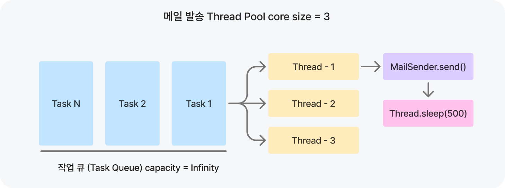
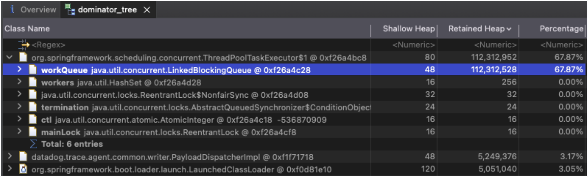
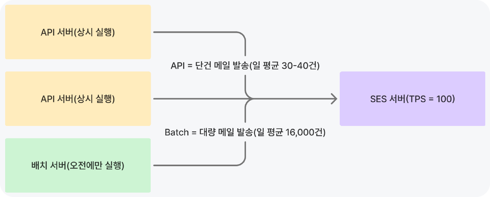
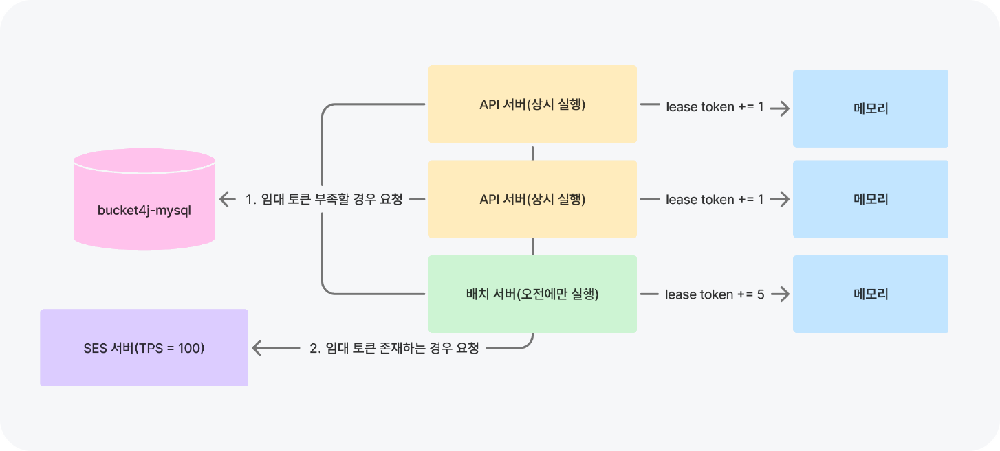

## AWS SES 처리율 제한 v1 - 스레드 풀 + Thread.sleep 방식

오픈카톡방을 대상으로 홍보를 진행한 이후, 하루 메일 전송 건이 50건에서 400건으로 급증했다. 다음 날 관리자용 메일 발송 결과 알림을 확인하는 과정에서 일부 메일이 정상적으로 전송되지 않은 것을 발견했다. 메일 발송 누락의 원인을 확인하기 위해 서버 로그를 분석한 결과, AWS SES(Simple Email Service)<sup id="ses">[[1]](#ses-ref)</sup>의 초당 **최대 전송 속도 제한인 14TPS를 초과**한 요청이 발생하고 있었고, 이로 인해 메일 전송 과정에서 오류가 발생한 것을 확인할 수 있었다.

이 문제를 해결하기 위해 **비동기 스레드 풀 내부의 Queue를 활용해 일정한 처리량을 유지**<sup id="core-pool-size">[[2]](#core-pool-size-ref)</sup>하도록 구조를 수정했다.

- 비동기 스레드 풀 내부 Queue의 capacity를 무한으로 설정
- 메일 전송 노드를 2대의 EC2로 운영하면서 각 노드의 비동기 코어 풀 사이즈를 3으로 설정
- 비동기 스레드에서 메일을 발송한 뒤 500ms의 지연 추가



비동기 스레드 풀을 사용한 처리율 제한은 지난 1년 이상 동안 문제없이 작동하여 **AWS SES의 처리량 초과 예외 발생률을 0%를 달성**할 수 있었다. 그리고, 다음과 같은 옵션도 함께 고려했다.

- 토큰 버킷 알고리즘 기반의 Bucket4j 적용 : 토큰을 소비한 이후 실제 전송이 지연되는 상황에서 새로운 토큰이 리필될 경우 AWS SES의 TPS 제한을 초과할 가능성이 있다고 판단했다.
- 별도의 처리율 제한 없이 단순히 재시도 수행 : 불필요한 네트워크 I/O 비용을 증가시킬 수 있다고 판단했다.

## AWS SES 처리율 제한 v2 - 토큰 버킷 + 임대 방식

사용자 1만 명 시점에 OOM이 발생해 사용자에게 전송될 메일이 누락된 적이 있다. 힙 덤프 분석 결과 **메일 발송 스레드 풀 내부 Queue가 과도한 메모리를 점유**하고 있음을 확인했다. 또한, 기존 구조는 core pool 사이즈와 sleep의 양을 기준으로 처리량을 제어하기 때문에 서버를 확장하기 어렵다는 단점을 가지고 있었다.

이 문제를 해결하기 위해서 **bucket4j-mysql**<sup id="bucket4j">[[3]](#bucket4j-ref)</sup>을 도입했다. 중앙 버킷 저장소로 MySQL을 선택한 이유는 다음과 같다.

- Redis는 인메모리 기반 저장소로 빠른 응답을 기대할 수 있지만, 클러스터 및 센티넬과 같은 HA 구성을 할 수 있을 정도로 팀 내부 자원이 여유가 있지 않았다.
- IMDG인 Hazelcast는 별도의 인스턴스를 분리하지 않아도 각 노드의 메모리를 사용해서 HA 구성<sup id="hazelcast-ha">[[4]](#hazelcast-ha-ref)</sup>을 할 수 있었다. 하지만, 현재 시스템 트래픽이나 메일 발송량을 고려했을 때 JVM 인스턴스 메모리를 사용하는 것은 MySQL의 한계점을 겪은 뒤에 해도 늦지 않다고 판단했다.

Hazelcast의 embedded mode와 클러스터 일관성에 대한 내용은 [Hazelcast 메모](/hazelcast/)에 따로 정리했다.



하지만, bucket4j-mysql을 그대로 사용하기에는 부족함이 있다고 생각했다. 왜냐하면, bucket4j-mysql은 토큰을 소비하기 위해 매번 `select ... for update` 쿼리를 발생시키고, 소비가 가능한 경우에는 `update` 쿼리를 추가로 발생시키기 때문이다. 이러한 동작은 메일 발송을 초당 수십-수백건씩 발송시키는 상황에서 **DB 장애로 이어질 수 있다고 판단**했다. 뿐만 아니라, SES 호출량을 최대치로 사용하지 못하는 상황에서는 **매번 DB RTT가 포함되기 때문에 처리량 저하가 예상**됐다.

초기 구현은 `RateLimiter`에서 bucket4j의 MySQL 기반 `ProxyManager`를 사용해 중앙 버킷을 조회하고, `tryConsume`마다 토큰 소비를 시도하는 방식이었다.

```java
@Component
public class RateLimiter {

    private final String bucketKey;
    private final Duration waitTimeout;
    private final BucketConfiguration bucketConfiguration;
    private final MySQLSelectForUpdateBasedProxyManager<Long> proxyManager;
    private final ConcurrentMap<String, BucketProxy> buckets = new ConcurrentHashMap<>();

    public RateLimiter(
            DataSource dataSource,
            @Value("${mail.ses.rate-limit.bucket-key}") String bucketKey,
            @Value("${mail.ses.rate-limit.capacity}") int capacity,
            @Value("${mail.ses.rate-limit.refill-amount}") int refillAmount,
            @Value("${mail.ses.rate-limit.refill-seconds}") long refillSeconds,
            @Value("${mail.ses.rate-limit.wait-timeout-millis}") long waitTimeoutMillis
    ) {
        this.bucketKey = bucketKey;
        this.waitTimeout = Duration.ofMillis(waitTimeoutMillis);
        this.bucketConfiguration = createConfiguration(capacity, refillAmount, Duration.ofSeconds(refillSeconds));

        SQLProxyConfiguration<Long> sqlProxyConfiguration = SQLProxyConfiguration.builder()
                .withTableSettings(BucketTableSettings.getDefault())
                .build(dataSource);
        this.proxyManager = new MySQLSelectForUpdateBasedProxyManager<>(sqlProxyConfiguration);
    }

    private BucketConfiguration createConfiguration(int capacity, int refillAmount, Duration refillDuration) {
        return BucketConfiguration.builder()
                .addLimit(Bandwidth.builder()
                        .capacity(capacity)
                        .refillIntervally(refillAmount, refillDuration)
                        .build())
                .build();
    }

    public void tryConsume() {
        if (!tryConsume(bucketKey, bucketConfiguration, waitTimeout)) {
            throw new IllegalStateException("SES 처리율 제한을 초과했습니다.");
        }
    }

    private boolean tryConsume(String key, BucketConfiguration configuration, Duration waitTimeout) {
        BucketProxy bucket = getOrCreateBucket(key, configuration);
        try {
            return bucket.asBlocking().tryConsume(1, waitTimeout);
        } catch (InterruptedException e) {
            Thread.currentThread().interrupt();
            return false;
        }
    }

    private BucketProxy getOrCreateBucket(String key, BucketConfiguration configuration) {
        return buckets.computeIfAbsent(key, bucketKey -> {
            long bucketId = bucketKey.hashCode();
            return proxyManager.builder().build(bucketId, configuration);
        });
    }
}
```

이를 해결하기 위한 하나의 방법은 서버마다 각자의 **고정된 처리 비율을 할당하고, 인메모리 방식**으로 처리율 제한을 수행하는 거라고 생각했다. 하지만, 이 방식은 **최대 호출량이 낭비된다는 단점**이 있다고 생각했다. 왜냐하면, 배치 서버는 오전에만 실행되고, API는 항상 실행되기 때문이다. 예를 들어, 배치에 60TPS를 할당하고 API 서버에 40TPS를 할당하면, 배치가 종료된 이후에 최대 호출량에서 60TPS가 낭비가 된다.



이 문제를 해결하기 위해서 DB 부하를 줄이는 대표적인 방법인 캐싱을 시도했다. **토큰 N개를 로컬 메모리에 저장하고, 임대 토큰이 유효한 시간 안에 사용하는 방법**<sup id="leased-token">[[5]](#leased-token-ref)</sup>이다. 이 방법은 DB 부하를 줄이면서도 최대 TPS는 제한할 수 있고, 동적으로 처리 비율이 결정되는 구조를 만들 수 있다고 생각했다.



코드 레벨의 내부 동작 방식은 다음과 같다.

- 임대 토큰이 존재하지만, 해당 임대 토큰이 유효 기간이 지난 경우에는 임대 토큰을 폐기
- 유효한 임대 토큰이 존재하면 소비하고, 아니라면 임대 토큰 대여
- bucket4j의 refill 정책을 intervally aligned 옵션<sup id="intervally-aligned">[[6]](#intervally-aligned-ref)</sup>으로 설정해서 유효 기간을 계산

```java
@Component
public class DistributedRateLimitSupport {

    private final DistributedTokenLeaseService leaseService;
    private final int leaseAmount;

    private long leasedTokens = 0;
    private long leaseExpiresAtMillis = 0;

    public synchronized boolean tryConsume() {
        // 로컬에 임대한 토큰은 다음 refill 경계까지만 유효하므로, 소비 전에 먼저 만료 여부를 확인한다.
        expireLeasedTokens(Instant.now());

        if (!ensureLeasedTokens()) {
            return false;
        }

        return consume();
    }

    private void expireLeasedTokens(Instant now) {
        if (leasedTokens > 0 && (now.toEpochMilli() >= leaseExpiresAtMillis)) {
            leasedTokens = 0;
            leaseExpiresAtMillis = 0;
        }
    }

    private boolean ensureLeasedTokens() {
        // 아직 유효한 임대 토큰이 남아 있으면 중앙 버킷을 조회하지 않고 로컬 토큰을 사용한다.
        if (leasedTokens > 0) {
            return true;
        }

        // 로컬 토큰이 없을 때만 중앙 버킷에서 leaseAmount만큼 토큰을 빌린다.
        if (leaseService.tryLeaseToken(leaseAmount)) {
            addLeasedTokens(leaseAmount, Instant.now());
            return true;
        }

        return false;
    }

    private void addLeasedTokens(int amount, Instant acquiredAt) {
        leasedTokens = amount;
        // bucket4j의 intervally aligned refill 정책과 동일한 초 경계를 로컬 토큰의 만료 시각으로 사용한다.
        leaseExpiresAtMillis = calculateNextRefillBoundary(acquiredAt).toEpochMilli();
    }

    private Instant calculateNextRefillBoundary(Instant now) {
        return Instant.ofEpochSecond(now.getEpochSecond() + 1);
    }

    private boolean consume() {
        if (leasedTokens < 1) {
            return false;
        }

        leasedTokens -= 1;
        if (leasedTokens == 0) {
            leaseExpiresAtMillis = 0;
        }

        return true;
    }
}
```

메일 전송 시점에는 `AbstractMailSender`에서 처리율 제한 토큰을 먼저 소비한 뒤, MIME 메시지를 생성하고 실제 전송을 수행한다.

```java
private void doSend(T message) {
    try {
        limiter.consumeBlocking(WAIT_TIMEOUT);
        logSending(message);
        MimeMessage emptyMimeMessage = javaMailSender.createMimeMessage();
        MimeMessage targetMimeMessage = mimeMessageCustomizer.customize(emptyMimeMessage, message);
        javaMailSender.send(targetMimeMessage);
        handleSuccess(message);
    } catch (RateLimitExceededException e) {
        logMailSendingFailed(e);
        throw new RetryableMailException(e);
    } catch (MailException e) {
        logMailSendingFailed(e);
        throwWhenCanRetry(e);
        handleAmbiguous(message);
    } catch (Exception e) {
        log.error("예기치 않은 오류 발생: {}", e.getMessage(), e);
        handleFailure(message);
    }
}
```

개선 결과를 확인하기 위해서 배치의 `mailSendStep`을 기준으로 매번 DB로 요청을 보내는 v1과 필요할 때만 요청하는 v2를 비교했다. **DB QPS가 84.7% 감소했고, 처리량도 50TPS 미만을 유지**<sup id="throughput">[[7]](#throughput-ref)</sup>했다. 버킷 한도를 최대치로 사용하지 않는 상황에서는 **RTT 감소의 효과로 인해 처리량 향상 또한 기대**할 수 있다.

임대량 5, bucket capacity 50, refill amount 50, refill duration 1sec, 처리 메일 건수 16087 기준 측정 결과는 다음과 같았다.

| 지표 | V1 | V2 | 변화 |
| :---: | :---: | :---: | :---: |
| 메일 발송 TPS | 46.2076 | 48.1456 | +4.2% |
| 전체 DB Questions | 66,754 | 9,831 | -85.3% |
| DB QPS | 191.7425 | 29.4225 | -84.7% |
| 메일 건당 DB 수신 트래픽 | 1.88KB | 0.15KB | -92.1% |

### 메모

<small id="ses-ref"><sup>[[1]](#ses)</sup> 메일 발송 서비스로 AWS SES를 사용했다. SES의 TPS 제한이 존재하는 이유는 고속의 대량 메일 발송을 하는 경우, 메일 수신 서버의 차단 가능성이 존재하기 때문이다.</small>

<small id="core-pool-size-ref"><sup>[[2]](#core-pool-size)</sup> core pool size = 3인 상황에서 500ms의 지연을 추가하면 초당 고정 처리량은 12TPS이며, 실제는 메일 발송 및 DB I/O가 포함되어 그 이하의 처리량이다.</small>

<small id="bucket4j-ref"><sup>[[3]](#bucket4j)</sup> bucket4j는 메모리 문제와 확장성 문제를 해결할 수 있는 토큰 버킷 기반 Rate Limiting 라이브러리다.</small>

<small id="hazelcast-ha-ref"><sup>[[4]](#hazelcast-ha)</sup> hazelcast에서 각 데이터 엔트리는 하나 이상의 파티션에 매핑되고, 해당 파티션의 replica에 저장된다. 데이터를 읽고 쓸 때는 primary replica를 보유한 hazelcast 멤버(노드)와 통신하게 된다.</small>

<small id="leased-token-ref"><sup>[[5]](#leased-token)</sup> 모든 서버에서 최대로 메일 발송을 수행할 때, 임대 토큰 할당량에 따라서 처리량이 동적으로 결정된다. A의 임대량을 1, B의 임대량을 5로 설정했을 때, TPS는 N1 = 10, N2 = 40이었다. API는 일 평균 30-40건의 메일을 발송하기 때문에 캐시 히트율이 낮다고 판단했다. 따라서, 임대량을 1로 설정했다.</small>

<small id="intervally-aligned-ref"><sup>[[6]](#intervally-aligned)</sup> bucket4j의 intervally aligned 옵션은 일정 간격으로 전체 토큰을 충전하고, 첫 번째 충전 시간이 발생하는 시간을 지정할 수 있다. 구현을 기준으로 첫 번째 충전 시간을 Instant.EPOCH로 설정했다. 따라서, 충전 주기를 1초로 설정한다면 벽시계 기준으로 매초마다 토큰이 충전된다는 것을 보장할 수 있다.</small>

<small id="throughput-ref"><sup>[[7]](#throughput)</sup> 처리량이 정확히 50이 아닌 이유는 메일 발송을 writer에서 수행하기 때문이다. 즉, reader와 processor의 영향으로 전체 처리량이 50이 아니게 된다. 실제로는 더 정확한 테스트를 위해 v1 RateLimiter와 v2 RateLimiter의 최대 TPS가 50을 초과하지 않는지 검증했다.</small>
