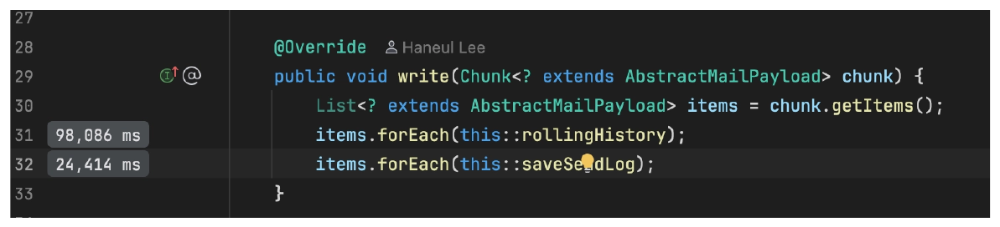
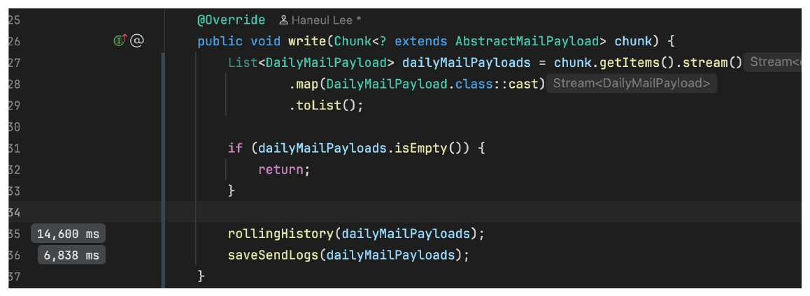
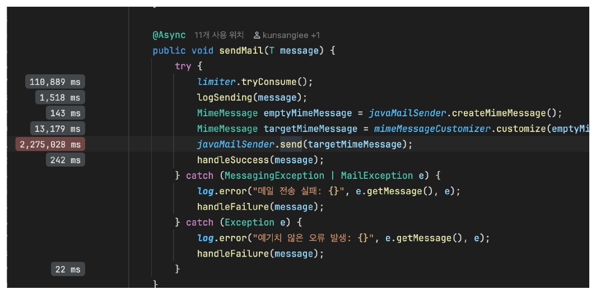
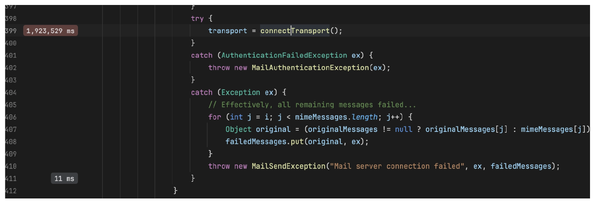
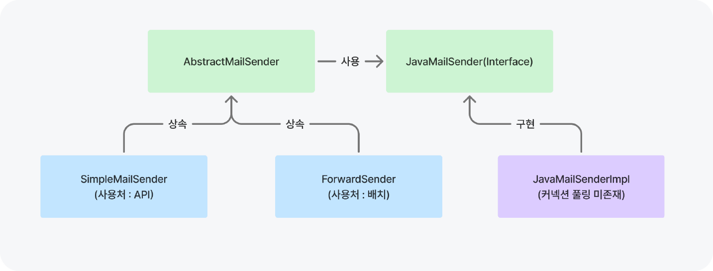
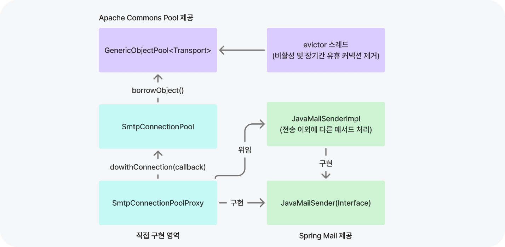

## 스프링 배치 Job 수행 시간 개선 - 목표편

스프링 배치 마이그레이션을 수행한 뒤에 실행해 봤는데, 41분 정도의 시간이 소요됐다. 실행 구성은 다음과 같았다.

- JVM 환경 : Amazon Corretto 17.0.4, -Xms1024m, -Xmx1024m, +UseG1GC, ActiveProcessorCount = 1
- 외부 의존성(docker) : MySQL, MailHog, MailProxy(TPS = 100)
- 발송 대상 건수 : 16,087건

이 **수행 시간을 줄여야 하는지에 대해서 사용자와 운영 관점에서 고민**했고, 필요하다고 판단했다.

- **사용자 관점** : 메일 발송을 한다고 사용자와 약속한 시각이 7시기 때문에 최대한 지키는 게 옳다고 판단했다. 단, 과거 사용자 인터뷰에서 크게 중요치 않다는 의견이 있었기 때문에 극단적인 개선은 불필요하다고 생각했다.
- **운영 관점** : 실행 시간이 적을수록 서버 비용이 줄어든다는 이점이 존재했다.<sup id="job-cost">[[1]](#job-cost-ref)</sup>

실행 시간은 AWS Lambda의 실행 시간 제한을 고려해 상한(15분)을 설정했고, SES TPS 100이 할당된 상황에서 처리 속도와 안정성 간의 trade-off를 검토해 하한(5분 21초)을 설정했다.

| 속도 | 시간 | 이유 |
| :---: | :---: | :---: |
| 상한 | 15분 | AWS Lambda 실행 시간 제한을 고려 |
| 하한 | 5분 12초 | 처리율 제한 에러 예방 및 메일 차단 가능성 낮추기 위함 |

- **trade-off** : 속도를 높일수록 실행 시간이 단축되어 서버 비용 감소 효과가 있다. 하지만, 메일 수신 서버에서 차단할 가능성이 증가한다.
- **상한** : AWS Lambda 선택지를 살리기 위해 실행 제한 15분을 상한으로 설정했다.
- **하한** : AWS SES TPS를 100을 할당받은 상황에서 전체를 전부 사용할지, 절반만 사용할지를 결정<sup id="lower-bound">[[2]](#lower-bound-ref)</sup>할 수 있었다. 절반만 사용하면, 토큰 버킷 알고리즘의 특정 초 경계에서 발생하는 버스트가 최대 TPS를 넘기지 않기 때문에 처리율 제한 에러 예방에도 효과적이다. (안정성 + 처리율 제한 에러 예방 차원에서 50TPS만 사용하기로 결정)
- **성능 목표** : 에러가 발생하지 않으면서, 5분 12초(16087건 / 50TPS) ~ 15분 사이의 수행 속도를 목표로 결정했다.

## 스프링 배치 Job 수행 시간 개선 - 개선편

접근 방식은 **단일 스레드로 할 수 있는 개선을 수행하고, 그럼에도 성능 목표를 달성하기 어려운 경우에 멀티 스레딩을 도입하기로 결정**했다. 이를 결정하기에는 다음과 같은 시행착오가 존재했다.



- 처음에는 무작정 로컬 파티셔닝을 사용한 멀티 스레드 방식을 도입했고, wait time을 기준으로 적정 스레드 풀 크기를 계산하며 여러 차례 실험했다.
- 하지만 적정 스레드 풀 크기는 wait time에 따라 계속 달라지며, 이후 다른 최적화를 적용할 때마다 다시 조정이 필요했다. 이 경험을 통해 단일 스레드 수준에서 최적화를 수행하고, 필요한 경우에만 멀티 스레딩을 도입하는 것이 더 안정적인 접근 방식이라고 판단했다.

처음 수행한 것은 **Writer(일간 메일 생성, 주간 메일 생성, 메일 전송)의 Item 별로 수행되는 쿼리 요청을 청크 단위로 DB에 전송하여 수행 시간을 개선**<sup id="writer-query">[[3]](#writer-query-ref)</sup>했다. 대표적으로 일간 메일을 생성하는 DailyMailSendWriter는 사용자가 받은 질문 내역(SubscribeQuestion)을 저장하고, 메일 발송을 위한 내역(ForwardLog)을 저장한다.

이때, 과거에 받은 질문 내역이라면 해당 내역을 제거하고 새로 생성한다는 요구 사항이 존재했다. 이 요구 사항을 달성하기 위해서, 청크의 Item 별로 총 4번의 쿼리가 발생하고 있었다. (insert 2회, delete 1회, select 1회) 이 비효율을 제거하기 위해서 청크 단위로 처리하도록 개선했다.



실제 Writer에서는 청크 전체를 `DailyMailPayloads`로 묶은 뒤, 기존 이력 삭제와 신규 이력/전송 로그 저장을 배치 단위로 수행한다.

```java
@Component
@RequiredArgsConstructor
public class DailyMailSendWriter implements ItemWriter<AbstractMailPayload> {

    private final SubscribeQuestionDao subscribeQuestionDao;
    private final ForwardDao forwardDao;

    @Override
    public void write(Chunk<? extends AbstractMailPayload> chunk) {
        DailyMailPayloads dailyMailPayloads = DailyMailPayloads.withChunk(chunk);
        if (dailyMailPayloads.isEmpty()) {
            return;
        }

        rollingHistory(dailyMailPayloads);
        saveSendLogs(dailyMailPayloads);
    }

    private void removeAlreadySaved(DailyMailPayloads payloads) {
        List<SubscribeQuestionKey> keys = payloads.getSubscribeQuestionKeys();
        List<Long> removeTargetIds = subscribeQuestionDao.findIdsByKeys(keys);

        subscribeQuestionDao.deleteByIds(removeTargetIds);
    }

    private void saveSubscribeQuestions(DailyMailPayloads payloads) {
        List<SubscribeQuestion> subscribeQuestions = payloads.toSubscribeQuestions();

        subscribeQuestionDao.batchInsert(subscribeQuestions);
    }

    private void saveSendLogs(DailyMailPayloads payloads) {
        List<ForwardLog> logs = payloads.toForwardLogs();

        forwardDao.batchInsert(logs);
    }
}
```

**Writer DB I/O 개선으로 Writer 간 소요 시간을 191초에서 24초로 개선**할 수 있었다. 그리고, 그다음은 Job에서 가장 많은 시간이 소요되는 메일 발송 로직이다. 해당 로직은 JavaMailSender.send에서 수행되며, 2,275초가 수행되는 가장 큰 병목 구간이었다.

| 대상 | before | after |
| :---: | :---: | :---: |
| DailyMailSendWriter | 123.4s | 12.4s |
| WeeklyMailSendWriter | 22s | 7s |
| ForwardWriter | 46.2s | 4.3s |

플레임그래프의 호출 트리를 탐색하다 스프링 부트 메일 스타터의 JavaMailSenderImpl의 **Transport 객체를 연결하는 데만 1,921초가 수행**<sup id="transport">[[4]](#transport-ref)</sup>되는 것을 파악했다. 메일을 전송할 때마다 연결을 맺는지 실제로 확인하기 위해서 SMTP 패킷을 확인한 결과, 매 TCP 스트림마다 메일을 전송하고 연결을 종료<sup id="smtp-quit">[[5]](#smtp-quit-ref)</sup>하는 것을 알 수 있었다.





**배치는 짧은 시간에 다수 메일을 연속 전송하기 때문에 커넥션 재사용 효과가 크다고 판단**했다. 이를 위해 관리되고 있는 SMTP Pool 라이브러리가 존재하는지 탐색했지만, 꾸준히 관리되고 있는 라이브러리가 없어 직접 Apache Commons Pool<sup id="commons-pool">[[6]](#commons-pool-ref)</sup>을 활용해 만들기로 결정했다.



AWS SES의 비활성 커넥션 유지 시간은 10초로 짧으며, API 서버는 요청 간 간격이 길기 때문에 풀링의 이점이 적다고 판단했다. 따라서, **배치만 JavaMailSender Proxy 구현체를 주입하는 방식으로 풀링 적용 범위를 최소화**했다.

배치 애플리케이션에서는 `BeanPostProcessor`를 사용해 `mailSender` 빈만 커넥션 풀 기반 프록시로 교체했다.

```java
public class MailSenderBeanPostProcessor implements BeanPostProcessor, DisposableBean {

    private SmtpConnectionPoolProxy pooledMailSender;

    @Override
    public Object postProcessAfterInitialization(Object bean, String beanName) throws BeansException {
        if (!"mailSender".equals(beanName) || !(bean instanceof JavaMailSenderImpl delegate)) {
            return bean;
        }

        SmtpConnectionProperties settings = SmtpConnectionProperties.from(delegate);
        SmtpConnectionPool connectionPool = new SmtpConnectionPool(settings);
        SmtpConnectionPoolProxy pooledMailSender = new SmtpConnectionPoolProxy(delegate, connectionPool);
        pooledMailSender.testConnection();

        this.pooledMailSender = pooledMailSender;

        return this.pooledMailSender;
    }

    @Override
    public void destroy() {
        if (pooledMailSender != null) {
            pooledMailSender.close();
        }
    }
}
```

프록시는 메일 전송 시점마다 새로운 SMTP 연결을 만들지 않고, 풀에서 빌린 `Transport`로 메시지를 전송한다.

```java
public class SmtpConnectionPoolProxy implements JavaMailSender, AutoCloseable {

    private final JavaMailSenderImpl delegate;
    private final SmtpConnectionPool connectionPool;

    @Override
    public void send(MimeMessage... mimeMessages) throws MailException {
        try {
            connectionPool.doWithConnection(getSendMailCallback(mimeMessages));
        } catch (Exception e) {
            throw new MailSendException("메일 전송을 실패했습니다.", e);
        }
    }

    private SmtpConnectionCallback getSendMailCallback(MimeMessage[] mimeMessages) {
        return transport -> {
            for (MimeMessage mimeMessage : mimeMessages) {
                sendMessage(transport, mimeMessage);
            }
        };
    }

    private void sendMessage(Transport transport, MimeMessage mimeMessage) throws Exception {
        if (mimeMessage.getSentDate() == null) {
            mimeMessage.setSentDate(new Date());
        }
        String messageId = mimeMessage.getMessageID();
        mimeMessage.saveChanges();
        if (messageId != null) {
            mimeMessage.setHeader("Message-ID", messageId);
        }

        Address[] recipients = mimeMessage.getAllRecipients();
        transport.sendMessage(mimeMessage, recipients != null ? recipients : new Address[0]);
    }
}
```

연결이 종료된 커넥션 사용<sup id="evictor">[[7]](#evictor-ref)</sup>으로 인한 메일 발송 실패를 고려해 Spring Retry 기반 재시도 백오프 로직을 추가했고, 해당 커넥션은 풀에서 제거하도록 구현해 연결 종료 커넥션 사용 리스크를 완화했다.

커넥션 풀링을 도입한 이후, **2,275초가 수행되는 메일 전송 구간을 180초로 개선**할 수 있었다.



마지막으로 사용자의 다음 질문을 결정하는 데 사용하는 **시퀀스 컬럼을 업데이트하는 Tasklet에서 사용하는 쿼리의 소요 시간이 프로덕션 기준으로 36초 수행**되고 있었다.

오래 수행되는 update 쿼리는 배치 실행 시간에 직접적인 영향을 주며, DB 레벨에서 CPU, I/O, 버퍼와 같은 자원을 장시간 점유하기 때문에 다른 기능에 간접적인 성능 영향을 줄 수 있다. 특히 해당 쿼리가 수행되는 시점에 사용자의 update 요청이 지연될 가능성도 있다고 판단했다.

- **업데이트 대상 건(subscribe)** : 1.6만 건
- **업데이트 대상 관련 테이블 건(subscribe_question)** : 250만 건

해당 쿼리는 `ChangeSequenceTasklet`에서 배치 마지막 단계에 수행한다.

```java
@StepScope
@Component
@RequiredArgsConstructor
public class ChangeSequenceTasklet implements Tasklet {

    private final SubscribeQuestionDao subscribeQuestionDao;

    @Value("#{jobParameters['datetime']}")
    private LocalDateTime dateTime;

    @Override
    public RepeatStatus execute(StepContribution contribution, ChunkContext chunkContext) {
        try {
            subscribeQuestionDao.increaseNextQuestionSequence(dateTime);
        } catch (Exception e) {
            log.error("구독자 시퀀스 증가 실패 baseDatetime = {}", dateTime, e);
        }

        return RepeatStatus.FINISHED;
    }
}
```

우선 해당 쿼리를 개선하기 위해 select 형태로 변경하고, 병목 부분의 실행 계획을 확인했다.

```sql
UPDATE subscribe AS s
SET s.next_question_sequence = s.next_question_sequence + (
    SELECT count(*)
    FROM subscribe_question AS sq
    WHERE sq.subscribe_id = s.id
      AND sq.created_at >= :baseDatetime
)
WHERE s.deleted_at IS NULL;
```

- 해당 쿼리는 상관 서브 쿼리 구조로 outer 테이블의 row 수 만큼 실행되고 있었다.
- 서브 쿼리 내부에서 Index look up으로 평균 78.6건의 데이터를 탐색하고 생성일을 기준으로 필터링하는 작업을 outer 테이블의 rows만큼 실행하고 있었다. (loops = 16087)

```text
Index lookup on sq using idx_sq_subscribe_question (subscribe_id=s.id)
(cost=25.1 rows=87.5) (actual time=0.302..0.307 rows=78.6 loops=16087)
```

**처음에는 상관 서브 쿼리의 실행 시간을 극단적으로 단축하면, 매번 실행하는 구조라도 상식적인 응답 시간 내에 수행될 수 있을 것이라 생각**했다. 이를 위해 (subscribe_id, created_at) 기준으로 복합 인덱스를 생성했다. 그리고, 커버링 인덱스를 이용한 PK 클러스터링 인덱스 접근 감소와 Index Range 스캔을 통해 실행 시간 향상을 기대했다.

실제로 커버링 인덱스 구조로 프로덕션 환경에서 36초 걸리던 update 쿼리가 3초로 단축됐다. 하지만, Index Range 스캔을 하지 않고, s.id를 통한 index lookup을 수행하고 있었다.

```text
Covering index lookup on sq using idx_sq_subscribe_created_at (subscribe_id=s.id)
(cost=5.91 rows=135) (actual time=0.0202..0.0341 rows=138 loops=16087)
```

이 원인을 파악하기 위해서 옵티마이저 트레이스 옵션을 사용해 고려했던 실행 계획을 확인했는데, 옵티마이저가 Range 스캔을 고려조차 하지 않았다. 이 단계에서 **현재 쿼리 형태에서 더 이상의 개선은 어렵다고 판단**했다. 각 쿼리 시간이 극단적으로 줄이는 것에 실패했다고 판단했기 때문이다.<sup id="range-condition">[[8]](#range-condition-ref)</sup> 이에 더 이상 매몰되지 않고, **group by + join 형태로 쿼리 구조를 변경**했다. 해당 쿼리는 (created_at, subscribe_id) 복합 인덱스를 추가해 Covering Index Range 스캔 형태로 **프로덕션 DB 기준 평균 379.6ms에 수행**됐고, 이 방법을 채택했다.

```sql
UPDATE subscribe AS s
JOIN (
    SELECT sq.subscribe_id, count(*) AS amount
    FROM subscribe_question AS sq
    WHERE sq.created_at >= :baseDatetime
    GROUP BY sq.subscribe_id
) AS sub
ON sub.subscribe_id = s.id
SET s.next_question_sequence = s.next_question_sequence + sub.amount
WHERE s.deleted_at IS NULL;
```

(최종 결과, 단일 스레드 기준) 메일 생성 스텝 1분 내외 + 전송 스텝 5분 30초 + 시퀀스 증가 Tasklet 1초 내 -> **6분 30초대**

### 메모

<small id="job-cost-ref"><sup>[[1]](#job-cost)</sup> 속도가 높을수록 동시 사용자도 높아진다는 단점이 존재하지만, 대부분 vercel 레벨에 캐시된 페이지를 읽기 때문에 고려 대상이 아니었다. 외부 자원을 API와 배치가 동시에 사용하는 시간이 줄어든다는 이점도 존재하지만, 이 역시 고려 대상이 아니었다.</small>

<small id="lower-bound-ref"><sup>[[2]](#lower-bound)</sup> 하한값을 계산하는 데 지나치게 매몰되기보다 의사결정 가능한 기준을 먼저 세우는 것이 중요하다고 판단했다. 이에 SES 할당량인 100TPS와, 안전 마진을 고려한 50TPS를 비교 가능한 옵션으로 두고 검토했다.</small>

<small id="writer-query-ref"><sup>[[3]](#writer-query)</sup> Processor 레벨에서 DB 쿼리를 사용하는 부분도 있지만, 해당 부분은 마이그레이션하기 이전부터 Spring Cache를 사용했기 때문에 고려 대상이 아니었다.</small>

<small id="transport-ref"><sup>[[4]](#transport)</sup> Transport는 커넥션을 담당하는 jakarta.mail 표준 클래스다.</small>

<small id="smtp-quit-ref"><sup>[[5]](#smtp-quit)</sup> 매 TCP 스트림마다 QUIT과 221 Bye라는 SMTP 메시지가 존재했다. 이는 SMTP에서 연결을 종료하기 위해 사용된다.</small>

<small id="commons-pool-ref"><sup>[[6]](#commons-pool)</sup> Apache Commons Pool은 오브젝트 풀링 구현을 제공해주는 오픈소스 라이브러리다.</small>

<small id="evictor-ref"><sup>[[7]](#evictor)</sup> Evictor 스레드를 활용해 비활성 유휴 커넥션을 주기적으로 정리한다. 비활성이 아닌 커넥션은 오래 사용할 수 있지만 하나의 커넥션을 길게 유지하면, 커넥션 종료 문제가 발생할 수 있다. AWS SES SMTP 엔드포인트는 ELB 뒤에 존재하는 EC2로 구성되어 있고, 시스템이 최신 상태 및 내결함성을 유지하기 위해 주기적으로 종료되고 새 인스턴스로 교체되기 때문이다.</small>

<small id="range-condition-ref"><sup>[[8]](#range-condition)</sup> 공식 문서를 확인한 결과, Range Condition에는 상수로 취급될 수 있는 값만 허용된다는 것을 파악했다. 그리고, 이 원인에 대해 subscribe_id가 외부 outer의 값에 따라 동적으로 변하는 값이기 때문인 걸로 추측했다.</small>
