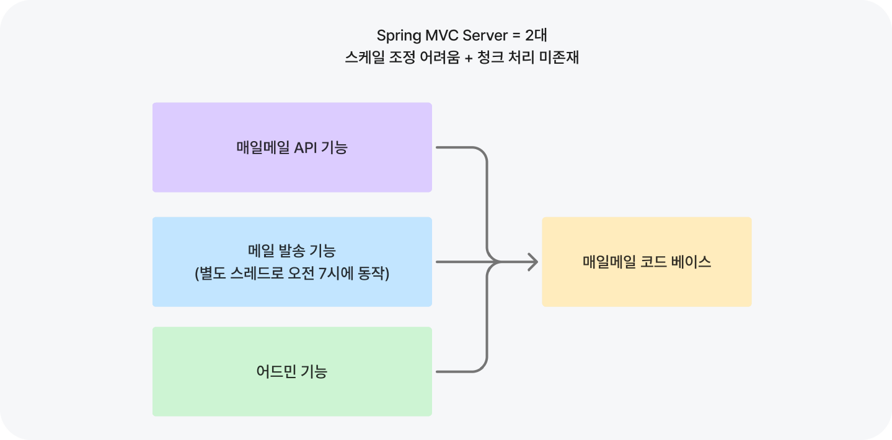
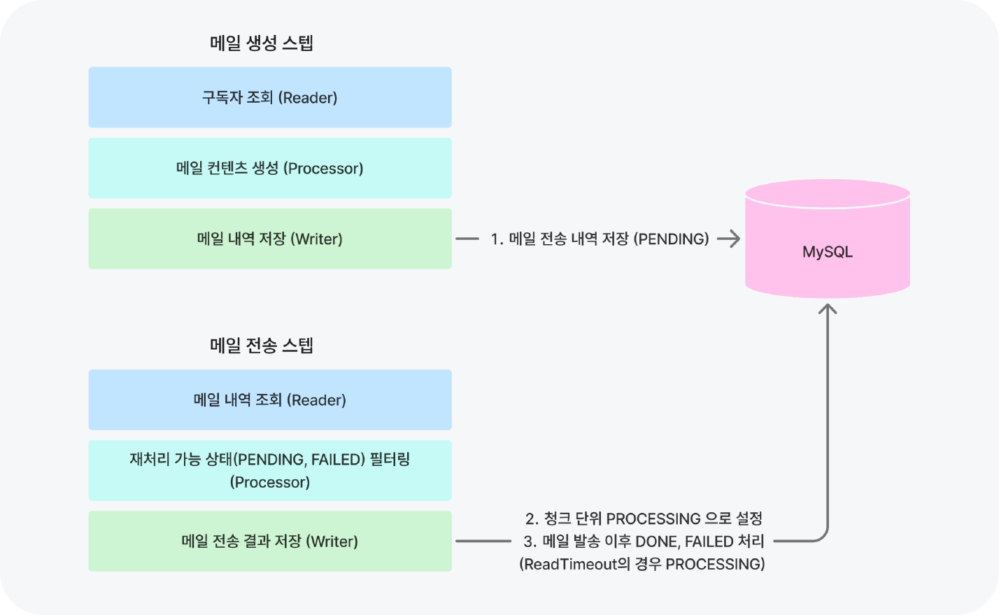

## 마이그레이션한 이유

서비스에서 가장 많이 호출되는 조회 API는 PK 기반 단건 조회와 Vercel 캐싱으로 충분한 처리량을 확보했지만, 메일 발송을 API 응답과 함께 수행하면서 **스케일 조정이 어려운 구조**<sup id="api-scale">[[1]](#api-scale-ref)</sup>였다. 또한, 청크 기반 처리를 하지 않고 있으므로 사용자가 늘어나면 **메모리 문제가 발생해 서버 장애로 이어질 가능성이 존재**했다.

이 문제를 해결하기 위해서 직접 청크 처리 및 별도 서버 분리를 수행할 수도 있었지만, 이미 스프링 배치에서 청크 처리, 확장성, 내결함성 기능을 지원해 주고 있기 때문에 **스프링 배치로 기존 전송 로직을 마이그레이션 하기로 결정**했다. 이 과정에서 고민했던 부분과 중요하게 생각한 부분은 다음과 같다.



실제 Job은 메일 생성, 메일 전송, 시퀀스 변경을 별도 Step으로 분리했다. 메일 생성 Step에서는 구독자를 읽어 메일 페이로드를 만들고, 메일 전송 Step에서는 생성된 전송 내역을 발송한다.

```java
@Bean
public Job mailSendJob(
        Step mailGenerateStep,
        Step mailSendStep,
        Step changeSequenceStep,
        JobExecutionListener mailSendJobReportListener
) {
    return new JobBuilder("mailSendJob", jobRepository)
            .start(mailGenerateStep)
            .next(mailSendStep)
            .next(changeSequenceStep)
            .listener(mailSendJobReportListener)
            .build();
}

@Bean
public Step mailGenerateStep(
        JdbcPagingItemReader<Subscribe> subscribeReader,
        CompositeItemProcessor<Subscribe, AbstractMailPayload> mailSendProcessor,
        ClassifierCompositeItemWriter<AbstractMailPayload> mailSendWriter
) {
    return new StepBuilder("mailGenerateStep", jobRepository)
            .<Subscribe, AbstractMailPayload>chunk(CHUNK_SIZE, transactionManager)
            .reader(subscribeReader)
            .processor(mailSendProcessor)
            .writer(mailSendWriter)
            .build();
}

@Bean
public Step mailSendStep(
        JdbcPagingItemReader<ForwardLog> mailSendReader,
        ForwardProcessor forwardProcessor,
        ForwardWriter forwardWriter
) {
    return new StepBuilder("mailSendStep", jobRepository)
            .<ForwardLog, ForwardLog>chunk(CHUNK_SIZE, transactionManager)
            .reader(mailSendReader)
            .processor(forwardProcessor)
            .writer(forwardWriter)
            .build();
}
```

## 고민했던 부분

### Reader 선택

초기에는 쿼리가 가장 단순하고, 스냅샷 효과를 내는 `JpaCursorItemReader`를 사용했다. 하지만, 프로세스 크래시 상황에서 스냅샷 효과를 잃을뿐더러 장시간 트랜잭션으로 인한 리스크(MySQL 언두 로그 증가)를 짊어질 필요가 없다고 생각해 Keyset Pagination을 사용하는 `JdbcPagingItemReader`를 선택했다.

```java
@Component
@RequiredArgsConstructor
public class MailSendItemReader {

    private final DataSource dataSource;

    public JdbcPagingItemReader<Subscribe> generate(LocalDateTime datetime) {
        return new JdbcPagingItemReaderBuilder<Subscribe>()
                .name("subscribeReader")
                .dataSource(dataSource)
                .pageSize(100)
                .selectClause("select id, email, category, next_question_sequence, token, deleted_at, frequency")
                .fromClause("from subscribe")
                .whereClause("where created_at <= :createdAt and deleted_at is null")
                .sortKeys(Map.of("id", Order.ASCENDING))
                .parameterValues(Map.of("createdAt", datetime))
                .rowMapper(getSubscribeRowMapper())
                .build();
    }
}
```

### 일간/주간 메일 생성 분기

구독 주기에 따라 일간/주간 메일 생성 로직이 달라지기 때문에 `ClassifierCompositeItemProcessor`, `ClassifierCompositeItemWriter`를 사용해 분기했다.

```java
@Component
@RequiredArgsConstructor
public class MailSendProcessorClassifier implements Classifier<Subscribe, ItemProcessor<?, ? extends AbstractMailPayload>> {

    private final ItemProcessor<Subscribe, AbstractMailPayload> dailyMailSendProcessor;
    private final ItemProcessor<Subscribe, AbstractMailPayload> weeklyMailSendProcessor;

    @Override
    public ItemProcessor<Subscribe, ? extends AbstractMailPayload> classify(Subscribe classifiable) {
        if (DAILY.equals(classifiable.getFrequency())) {
            return dailyMailSendProcessor;
        }

        return weeklyMailSendProcessor;
    }
}

@Component
@RequiredArgsConstructor
public class MailSendWriterClassifier implements Classifier<AbstractMailPayload, ItemWriter<? super AbstractMailPayload>> {

    private final ItemWriter<AbstractMailPayload> dailyMailSendWriter;
    private final ItemWriter<AbstractMailPayload> weeklyMailSendWriter;

    @Override
    public ItemWriter<? super AbstractMailPayload> classify(AbstractMailPayload classifiable) {
        if (classifiable instanceof DailyMailPayload) {
            return dailyMailSendWriter;
        }

        return weeklyMailSendWriter;
    }
}
```

### 테스트 코드 추가

레거시 로직을 배치로 이전하며 약 90개의 테스트를 추가해 안정성을 확보했다. (테스트 컨테이너 기반 통합 테스트 및 단위 테스트)

### at-most-once / at-least-once 전략 선택

AWS SES 호출은 멱등하지 않아 배치 서버에서 SES로 보내는 메시지를 Exactly Once 처리하기 어려웠다. 이를 위해 at-least-once와 at-most-once 전략을 고려했다.

| 전략 | 내용 | 사용자 경험 |
| :---: | :---: | :---: |
| at-least-once | 중복 발송으로 인한 메일 발송 비용 증가 | 중복 메일 수신으로 사용자 경험 저하 |
| at-most-once | 메일 발송 비용 변동 없음 | 메일 누락으로 사용자 경험 저하 |

at-most-once와 at-least-once는 각각 메일 누락과 중복 발송이라는 형태로 모두 사용자 경험에 부정적인 영향을 줄 수 있다. 현재는 중복 발송으로 인한 비용 증가와 처리 복잡도보다, 일부 불확정 호출을 누락으로 처리하는 편이 더 낮은 운영 비용을 만든다고 판단해 **at-most-once 전략을 선택**했다. 이후 실제 운영에서 발생하는 호출 불확정 케이스를 관찰하며 현재 정책을 보완할 계획이다. 아래는 at-most-once를 달성하기 위한 설계다.



- 메일 전송 내역을 만드는 스텝과 메일을 전송하는 스텝을 분리했고, 전송 내역에 PENDING, PROCESSING, DONE, FAILED 등 4가지 상태를 추가해 **호출 불확정 상태를 식별**했다.
- 전송 내역 청크를 처리하는 Writer에서 청크 트랜잭션과 독립된 별도의 트랜잭션을 생성해 현재 전송 내역 청크를 **PROCESSING 상태로 변경하고, 메일 발송을 수행**한다.
- 메일 전송 메서드에서 Spring Retry를 통해 재시도 가능한 예외(처리율 제한 에러, SMTP 커넥션 종료 등)는 처리하되, **Read Timeout과 같은 호출 불확정인 상태는 재처리하지 않고, PROCESSING 상태로 유지**했다.

코드 레벨에서는 Read, Processing, Writer 단계가 다음처럼 나뉜다.

#### Read

전송 Step의 Reader는 특정 시간 범위의 `forward_log`를 읽는다. 상태 필터링은 Reader가 아니라 Processor에서 수행하도록 분리했다.

```java
@Component
@RequiredArgsConstructor
public class ForwardReader {

    private final DataSource dataSource;

    public JdbcPagingItemReader<ForwardLog> generate(LocalDateTime startDateTime, LocalDateTime endDateTime) {
        return new JdbcPagingItemReaderBuilder<ForwardLog>()
                .name("forwardLogReader")
                .dataSource(dataSource)
                .pageSize(100)
                .selectClause("select id, target, subject, message, status")
                .fromClause("from forward_log")
                .whereClause("""
                        where created_at >= :startDateTime
                          and created_at < :endDateTime
                        """)
                .sortKeys(Map.of("id", Order.ASCENDING))
                .parameterValues(Map.of(
                        "startDateTime", startDateTime,
                        "endDateTime", endDateTime
                ))
                .dataRowMapper(ForwardLog.class)
                .build();
    }
}
```

#### Processing

Processor는 재시도 가능한 상태만 다음 단계로 넘긴다. `PENDING`과 `FAILED`만 재처리 대상으로 보고, `PROCESSING`은 호출 불확정 상태로 남겨 중복 발송을 피한다.

```java
@Slf4j
@Component
public class ForwardProcessor implements ItemProcessor<ForwardLog, ForwardLog> {

    @Override
    public ForwardLog process(ForwardLog item) {
        if (!item.isRetryable()) {
            log.info("메일 전송 호출을 식별할 수 없어 질문지를 전송할 수 없습니다. email = {} status = {}", item.getTarget(), item.getStatus());
            return null;
        }

        return item;
    }
}

public class ForwardLog extends BaseEntity implements MailMessage {

    public boolean isRetryable() {
        return ForwardStatus.FAILED.equals(status) || ForwardStatus.PENDING.equals(status);
    }
}
```

#### Writer

Writer는 메일을 보내기 전에 별도 트랜잭션으로 상태를 `PROCESSING`으로 변경한다. 그 뒤 실제 메일 발송을 수행하고, 명확히 성공/실패로 판단된 항목만 `DONE`, `FAILED`로 갱신한다.

```java
@Component
@RequiredArgsConstructor
public class ForwardWriter implements ItemWriter<ForwardLog> {

    private final ForwardDao forwardDao;
    private final ForwardSender forwardSender;

    @Override
    public void write(Chunk<? extends ForwardLog> chunk) {
        if (chunk.isEmpty()) return;
        forwardDao.changeStateWithNewTx(chunk.getItems(), ForwardStatus.PROCESSING);
        chunk.forEach(forwardSender::sendMailSync);
        bulkWrite(chunk);
    }

    private void bulkWrite(Chunk<? extends ForwardLog> chunk) {
        List<ForwardStatus> targets = List.of(ForwardStatus.DONE, ForwardStatus.FAILED);

        targets.forEach(it -> {
            List<? extends ForwardLog> logs = getLogs(chunk, it);
            forwardDao.changeState(logs, it);
        });
    }
}
```

호출 결과가 명확하면 `ForwardSender`가 상태를 `DONE` 또는 `FAILED`로 변경한다. 반면, 호출 성공 여부를 알 수 없는 예외는 `PROCESSING`으로 유지한다.

```java
@Slf4j
@Component("forwardMailSender")
public class ForwardSender extends AbstractMailSender<ForwardLog> {

    @Override
    protected void handleSuccess(ForwardLog forwardLog) {
        forwardLog.setStatus(ForwardStatus.DONE);
    }

    @Override
    protected void handleFailure(ForwardLog forwardLog) {
        forwardLog.setStatus(ForwardStatus.FAILED);
    }

    @Override
    protected void handleAmbiguous(ForwardLog forwardLog) {
        forwardLog.setStatus(ForwardStatus.PROCESSING);
    }
}
```

`PROCESSING`으로 먼저 변경하는 작업은 별도 트랜잭션에서 수행한다. 따라서 이후 메일 발송 중 프로세스가 종료되어도 이미 발송 시도 중이던 청크를 다시 `PENDING`처럼 읽지 않는다.

```java
@Component
@RequiredArgsConstructor
public class ForwardDao {

    private final NamedParameterJdbcTemplate jdbcTemplate;

    @Transactional(propagation = Propagation.REQUIRES_NEW)
    public void changeStateWithNewTx(List<? extends ForwardLog> logs, ForwardStatus status) {
        changeState(logs, status);
    }

    @Transactional
    public void changeState(List<? extends ForwardLog> logs, ForwardStatus status) {
        if (logs.isEmpty()) {
            return;
        }

        logs.forEach(it -> it.setStatus(status));
        doChangeStatus(logs, status);
    }
}
```

## 메모

<small id="api-scale-ref"><sup>[[1]](#api-scale)</sup> 서비스에서 가장 많이 호출되는 질문 조회 API는 PK const 쿼리로 vercel 캐싱이 아니어도, 동시 사용자 50명 기준 300TPS 이상의 처리량을 보인다. 이 외에 API 호출은 상대적으로 호출량이 적다. 다만, API 서버가 메일 발송을 함께 수행하므로, 스케일 다운이 어려운 상황이었다.</small>
