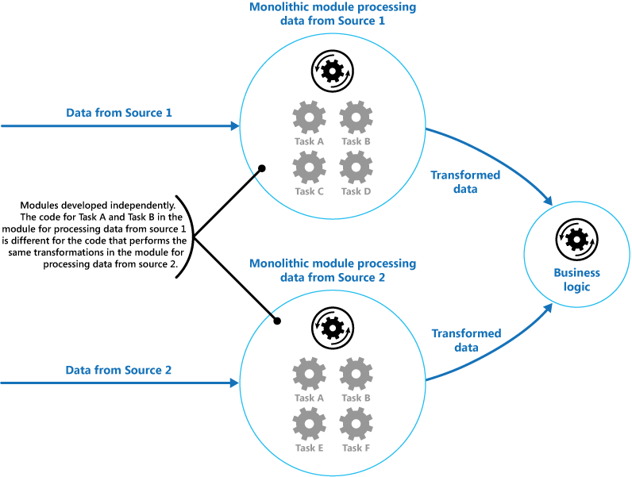
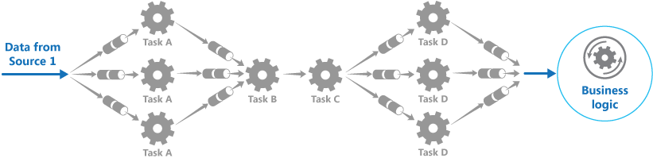

### 1. 모놀리식 모듈 처리 패턴의 문제

어플리케이션은 처리되는 정보의 복잡도가 서로 다른 여러 작업을 수행해야 한다. 간단하면서도 유연성 없는 어플리케이션 구현 방식은 이 처리를 모놀리식 모듈로 수행한다.
아래 사진은 두 가지 데이터를 받아서 처리하는 모놀리식 방법이다.

</img>

모놀리식 모듈이 수행하는 작업 일부는 기능적인 측면에서 아주 유사하지만 서로 다르게 설계되어 있다. 작업을 구현하는 코드는 모듈 내에 밀접하게 결합 되어 있으며,
재사용, 확장성을 거의 고려하지 않고 개발되었다. 모듈 처리 과정을 재배치하거나, 나중에 재사용하기에 어려움이 생긴다. 이러한 문제점의 해결 방법으로 **파이프-필터 패턴**
을 사용할 수 있다.

### 2. 파이프-필터 패턴이란?

파이프-필터 패턴은 데이터 스트림 절차의 각 단계를 필터 컴포넌트로 캡슐화하여 파이프를 통해 데이터를 전송하는 패턴이다.

> 쉽게말해, 받아온 데이터를 처리할때, 특수한 관(파이프=필터로 구성되어 있음)에 넣어 캡슐화하고 비즈니스 로직에 전달하는 것이다.

</img>

우선 나는 이 그림을 처음봤을 때,**위 그림에서 필터는 톱니바퀴(TASK)이고 파이프는 필터의 직렬 구성**이라고 생각했다.<br><br>
각 스트림에 필요한 처리를 각각 단일 작업을 수행하는 일력의 독립 구성 요소(또는 필터)로 나눈다. 각 구성 요소가 받아서 보내는 데이터의 형식을 표준화하면, 이 필터를 하나의
파이프 라인으로 결합할 수 있다. 이렇게 하면 코드 중복을 방지할 수 있고, 구성 요소를 제거, 대체, 통합하는게 쉬워진다. <br><br>

**단일 요청을 처리하는 데 소요되는 시간은 파이프라인에서 가장 느린 필터의 속도에 좌우된다.** 한 개 이상의 필터로 인해(특히 특정 데이터 원본의 스트림에서 대량의 요청이 나타날 때) 병목현상이 발생할
수 있다. 파이프라인 구조의 주요장점은 느린 필터의 병렬 인스턴스를 실행할 수 있어 시스템이 부하를 분배하고 처리량을 개선할 수 있다는 것이다.

</img>

> 위 그림을 보면 TASK A 필터와 TASK B 필터가 병렬구성되어 시스템 부하 및 처리량을 개선하고 있다.(파이프-필터 로드 밸런싱이라고 함)

### 3. NestJS에서는?🙄

nest에서는 위와 같은 구조에서 영감을 받아 파이프라는 걸 생각해낸 것 같다.

> 파이프는 @Injectable() 데코레이터로 주석이 달린 클래스다. 파이프는 PipeTransform 인터페이스를 구현해야 한다.

```ts
@Injectable()
export class MyTestPipe implements PipeTransform {
  transform(value: number) {
    //.....
    return value
  }
}
```

<br>
위와 같이 파이프가 데이터를 받아서 값을 변환하거나, 유효성 검사하여 비즈니스 로직에 전달한다.
<br><br>

```ts
@Controller('/test')
export class testController {
  constructor(private readonly testService: TestService) {}
  @Get(':id')
  getOnetest(@Param('id', ParseIntPipe, MyTestPipe) id: number) {
    return this.testService.foo(id) //TestService안에 대응하는 비즈니스로직함수 호출;
  }
}
```

<br>
ParseIntPipe -> MyTestPipe 순서로 전달된다. ParseIntPipe는 Nest에서 기본적으로 제공하는 파이프인데, ParseIntPipe 포함 총 6가지가 있다.
<br><br>

#### 참고

- [[NestJS] 파이프 개요](https://docs.nestjs.kr/pipes)
- [[MS DOCS] 파이프 및 필터 패턴](https://docs.microsoft.com/ko-kr/azure/architecture/patterns/pipes-and-filters)
