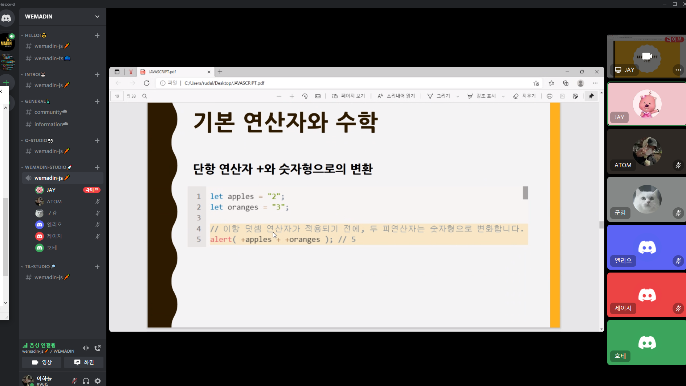
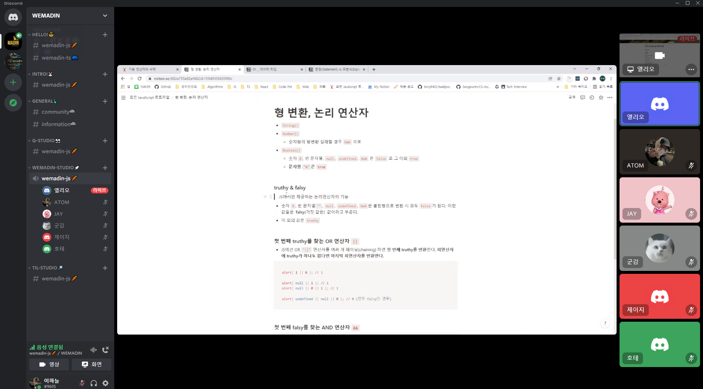
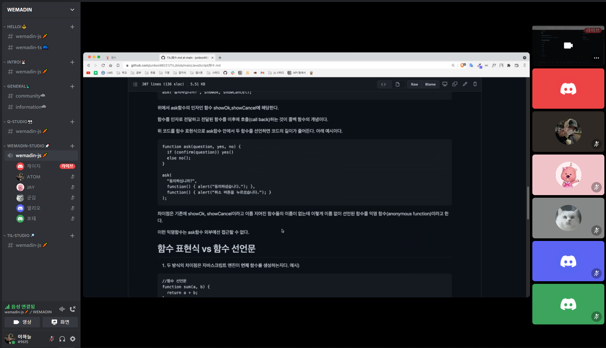

### 1. WEMADIN 이란?

자바스크립트로 코딩하면서 core한 부분을 놓치는 경우도 있었고, 배웠던 것도 뭔가 남들에게 설명하는 부분이 미흡했던 느낌을 받았었습니다.
그래서 바닐라 JS의 중요성을 깨닫고 다시한번 자바스크립트를 깊게 학습하기 위해서 WEMADIN 스터디 크루를 열게 되었습니다.
기존의 스터디들은 이론을 공부하고, 모르는 걸 물어보고, 다같이 으쌰하는 식입니다. 하지만 저는 그런 스터디 말고 좀더 자바스크립트 개발자다운
스터디를 원했습니다.

> 그럼 자바스크립트다운 공부 방법은 무엇일까?

위와 같은 고민을 했었고, 이러한 고민을 해결하기 위해 자바스크립트의 주요 특징들을 생각해 봤습니다! 가장 큰 특징 중 하나로는 자바스크립트 언어 기반
으로 타입스크립트, react, nodejs, express,nestjs,angular,vue,next,nuxt,react-native... 정말 많은 라이브러리, 프레임워크, 트랜스파일 언어 등등
많은 파생이 생긴다는 것입니다.

 

이러한 특징을 기반으로 <b>WEMADIN, 무언가에 미치다! 라는 의미로 스터디 크루를 열게 되었고, 디스코드 서버 기반으로 비대면으로 진행했습니다.</b>
그래서 저희 크루의 첫번 째 스터디, WEMADINJS 가 탄생하게 됐습니다. 만약 크루원 중 react 스터디 혹은 크루를 만들고 싶다면, 이 디스코드 기반으로 
WEMADIN react 이런 식으로 크루를 운영할 수 있도록 확장성 있게 만들었습니다.

> 물론! 실패할 수 도 있습니다. 하지만 자신의 생각을 증명하는 과정을 통해 더욱 성장할 수 있는 기회가 될 수 있을 것 같습니다.

</img>

> 그래도 많은 분들이 열심히 참여해 주셔서 감사했습니다!

### 2. 1주차 후기

캠퍼스픽 어플로 저를 포함한 7명의 크루원이 모였고 1주차 챕터를 공부한 이후 주말에 스피치를 진행했습니다. 자신이 가장 중요하다고 생각하는 내용을 발표하는
과정을 통해 좀 더 깊이있는 배움을 느낄 수 있을 것이라 예상했고, 남들에게 설명할 수 있는 지식이 진정하게 자신이 습득한 지식이라고 생각합니다.

> 또 미래에 닉네임을 쓰는 회사에서 사용할 수 있도록, 수평적인 분위기 조성을 위하여 닉네임을 사용했습니다! 저는 ATOM(avoid out of memory) 라고 지어봤습니다🤣

</img>
<b>JAY님의 발표! 발표 ppt까지 만들어 오셔서 놀랐습니다.</b>

</img>
<b>프론트 엔드 개발자가 목표이신 엘리오 님의 발표 사진입니다.</b>

</img>
<b>프론트 엔드 개발자가 목표이신 제이지 님의 발표 사진입니다.</b>

 
[1주차 - 자바스크립트 기본]을 발표하면서 저도 많이 당황하고 어벙했었습니다.. 역시 알고 있는 것과 남들에게 설명하는 건 큰 차이가 있었던 것 같습니다.
다음주에는 좀 더 열심히 준비해서 발표를 해야겠다 느꼈습니다.😂
 
