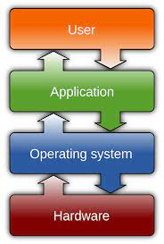

### 1. 운영체제 정의

운영체제는 컴퓨터 하드웨어를 잘 관리하고, 성능을 높이고, 사용자에게 편의성을 제공하며,
컴퓨터 하드웨어를 관리하는 프로그램입니다.
<br>

```js
keyword: Performance, Convenience, Control program for computer
```

<br>
운영체제가 있어야 다중 프로그래밍 환경을 지원하고, 프로그램을 메모리에 올릴 수 있고
효율적으로 메모리에 올려져 있는 프로그램을 처리할 수 있고, 하드 디스크에 저장도 잘 할 수 있고,
프린터에 인쇄 명령을 내리고, 못하는게 없다. 최고😂

> 운영체제가 없는 컴퓨터는 야생마와도 같다. 라고 표현한 점이 인상 깊었습니다.

### 2. 부팅(Booting)

컴퓨터의 구조는 프로세서, 메모리, 디스크(보조기억장치)로 이루어져 있습니다.
그 중 주 기억 장치(main memory)는 ROM과 RAM으로 나뉘어져 있습니다. rom은 비휘발성 메모리이고
전원이 꺼져도 내용을 유지합니다. 우리의 귀여운 친구 rom은 ram에 비해서 작은 용량을 가지고 있는데
그 역할은 정말 중요합니다.
<br>
<br>

```js
keyword: 프로세서, 메모리, rom과 ram, POST, boot loader, kernel, shell, command interpreter
```

<br>
OS는 정의에서 말했듯이 무언가 관리하는 프로그램이죠, 프로그램이면 우선
보조기억장치에 저장이 될 것이고, 메모리에 올라가야 프로세서가 처리할 수 있습니다.
그럼 이걸 어떻게? 올리느냐 생각해 봤을 때, 우리의 귀여운 친구 ROM!이 등장하게 됩니다.😃
<br>
<br>

<p>
<b>rom은 비휘발성 메모리로 POST(Power-On Self-Test)와 Boot Loader을 실행</b>하게 됩니다.
컴퓨터에 전기가 들어왔을 때, rom에서 POST를 실행하게 됩니다.
</p>

> 컴퓨터 괜춘? 메모리 얼마나 있음? 굳굳 오케이 boot loader 실행할게~

POST를 통해서 컴퓨터가 괜춘한지 test하고 보조기억장치에 있는 OS 프로그램을 ram에 올리기 위해서
boot loader를 실행하게 됩니다.

> boot loader 를 실행한 이후 ram에는 os 프로그램이 이쁘게 올라갑니다!
> ram에 os가 올라오면 booting이 완료된거라고 할 수 있습니다.😎

우리의 귀여운 친구 ROM의 역할은 여기까집니다. 평소에는 몰랐는데 정말 소중한 친구였군요
이 이후에는 든든한 친구 OS에게 맡깁니다. OS는 kernel(관리를 담당하는 프로그램), shell(명령어 해석기)
로 이루어져 있습니다.
<br>

### 3. 운영체제의 위치

<p>
<b>컴퓨터 시스템은 하드웨어 > 운영체제 > 어플리케이션으로 구성</b>되어 있습니다.
</p>

<p align="center">
    
</p>

```js
keyword: resource manager, resource allocator
```

<br>

> 운영체제는 정부와 비슷하다! 라는 말이 인상 깊었습니다.

행정부, 교육부, 국방부 등으로 나눈 후 국토 인력 예산이라는 자원을 효율적으로 사용하기 위해
자원 관리자, 자원 할당자등을 나누는 것이 OS와 유사합니다. OS도 자원을 효율적으로 관리하기 위해 process management 부서, memory management 부서, i/o management 부서, network management 부서, protection management 부서 등등 여러 부서가 존재합니다.

#### 참고

- [경성대학교 양희재 교수님 운영체제](http://www.kocw.net/home/search/kemView.do?kemId=978503)
