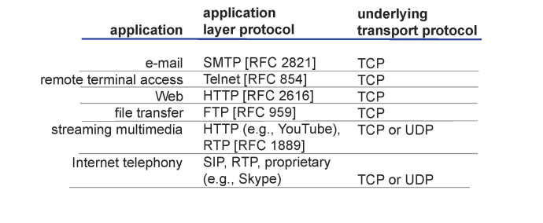

### 1. 패킷 지연 비유 - Caravan analogy

차량 열대가 항상 한꺼번에 다녀야하는 상황입니다.차량이 하나가 비트고 열대가 하나의 패킷입니다. 톨 게이트는 라우터입니다.
시속 100 km의 차량의 속도는 Propagation delay(전파 지연)입니다. 모든 차량이 첫번 째 라우터를 지나가는 순간까지의 걸린 시간이 Transmission delay(전송 지연)입니다. 즉 전송 지연은 라우터가 패킷을 내보내는 데 필요한 시간입니다. 아래 예시에서는
모든 차량이 톨게이트를 나오는 시간 120초가 걸립니다.


### 2. Network App

우리는 기본적으로 네트워크 앱을 개발할 때 Network core의
라우터를 신경쓸 필요가 없습니다. 우리의 네트워크 앱은 다른
End Systems들과의 Communication만 신경쓰면 됩니다.
왜냐하면 라우터들은 바보라서 네트워크 레이어까지만 지원합니다.
<br>

### 3. Client-server architecture

다들 알고있는 서버-클라이언트 모델입니다.

- server:
  - always-on host
  - permanent IP address
  - data centers for scaling
- clients:
  - communicate with server
  - may be intermittently connected
  - may have dynamic IP addresses
  - do not communicate directly with each other

### 4. Processes communicating

호스트 안에서 실행중인 프로그램을 프로세스라고 합니다.
같은 호스트 안에서 두개의 프로세스간의 통신을 하기 위해서는
inter-process commnication(defined by os)를 이용합니다.
다른 호스트 환경에 존재하는 프로세스 간의 통신을 하기 위해서는
Message exchange를 사용합니다. <br>

- client process: 통신을 시작하는 프로세스입니다.
- server process: 통신 연결을 기다리는 프로세스입니다.

```js
P2P 아키텍쳐의 어플리케이션은 클라이언트 프로세스와 서버 프로세스를
가집니다.
```

### 5. Sockets

프로세스들은 소켓을 통해서 메시지들을 보내거나 받습니다.
소켓은 다른 컴퓨터와 데이터를 통신하기 위한 인터페이스입니다.
IP와 port를 이용해서 통신합니다.


### 6. 전송 서비스 요구 사항

전송 서비스에는 여러가지 요구 사항이 있을 수 있습니다. 전송 계층 프로포톨 TCP에서는 Data integrity만을 보장합니다. 나머지는 어플리케이션 레이어에서 해결합니다.

- Data integrity(데이터 무결과 관련된 요구사항)
- Timing(시간적인 요구사항: 적은 지연을 요구합니다.)
  - 전화나 상호작용이 중요한 게임(LOL 같은 것)
- Throughput(처리량과 관련된 요구사항)
  - 멀티미디어 어플리케이션이 예입니다.
- Security(보안과 관련된 요구사항)

### 7. 유명한 어플리케이션 앱과 프로토콜의 관계 예시



### 8. 웹과 HTTP

기본적으로 알아야 하는 것들은 아래와 같습니다.


HTTP(hypertext transfer protocol)는 웹 어플리케이션 레이어 프로토콜입니다. 클라이언트(대표적으로 브라우저)가 리퀘스트를 보내고 결과를 받을 때 HTTP 프로토콜을 사용해서 받습니다. 또한 받은 Web object들을 화면에 표시합니다.
<br>
반면 서버는 HTTP 프로토콜을 이용해서 Web object들을 클라이언트에게 보냅니다.(Response)

### 9. HTTP 개요

HTTP는 TCP위에서 작동하는 어플리케이션 레이어 프로토콜입니다. 클라이언트는 TCP 커넥션을 80번 포트를 이용해서 엽니다. 서버는 TCP 커넥션을 받습니다. 또한 HTTP는 stateless합니다. 이전의
클라이언트의 리퀘스트 정보를 유지하지 않습니다.


### 10. HTTP Connections

HTTP가 TCP 커넥션을 사용하는 방식에 따라서 두가지로 나뉘어 집니다. TCP 커넥션을 유지시킬 것인가 아닌가에 따라 나뉘어 진다고 볼 수 있습니다. (TCP 커넥션 재사용 여부)


### 11. Non-persistent HTTP(TCP 재사용 안함)


Non-persistent인 경우 서버의 응답 이후에 아래처럼 TCP 커넥션을 끊습니다. 파일이 더 필요할 경우 TCP 커넥션을 다시 열고 리퀘스트를 전송합니다.(반복😂) 다행히도 현대의 HTTP는
persistent HTTP를 사용합니다.


#### 11-1. Non-persistant HTTP: response time


<br>

#### 참고

- [한양대학교 이석복 교수님 네트워크](http://www.kocw.net/home/search/kemView.do?kemId=1169634)
