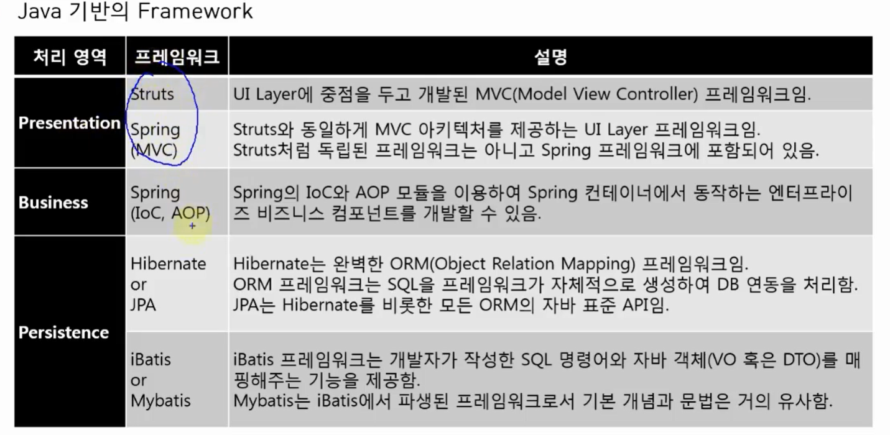
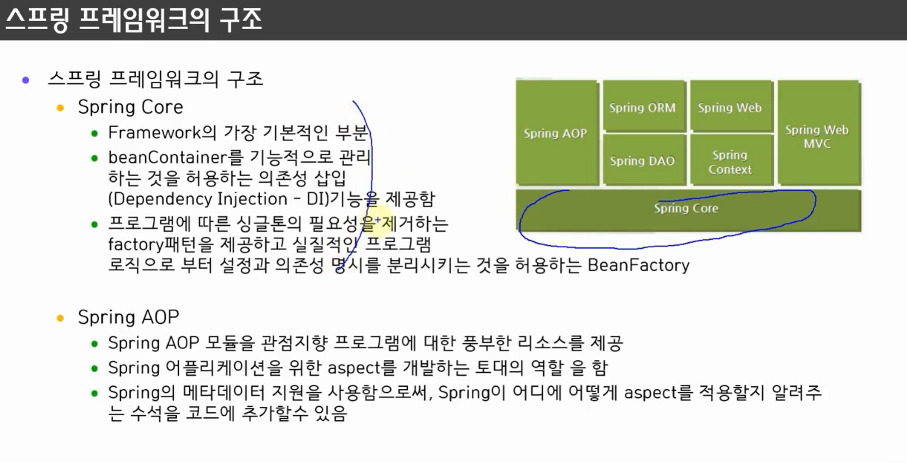
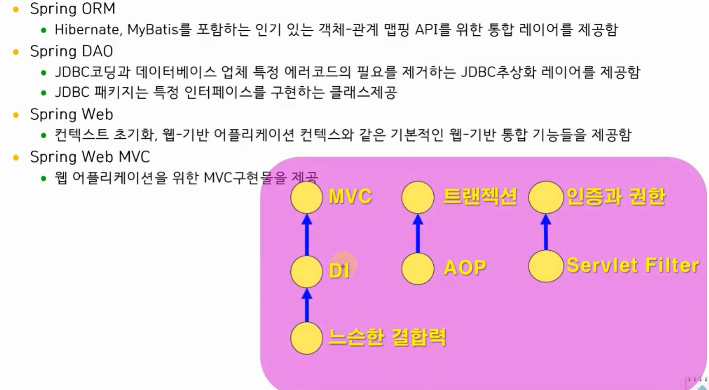

### 1.프레임워크란?

프레임워크는 어플리케이션을 개발할 대, 아키텍처에 해당하는 골격 코드를 제공합니다. 솔루션이 완제품이라면
프레임워크는 반제품에 해당합니다. 그럼 스프링은 어떨까요? 스프링 프레임워크는 2004년 로드 존슨이 만든 오픈소스
프레임워크이며, IoC와 AoP를 지원, JAVA개발을 편하게 해주는 오픈 소스 프레임워크으로
객체 지향에 충실한 설계가 가능하도록 합니다.

프레임 워크의 장점:

- 빠른 구현 시간
- 쉬운 관리
- 개발자들의 역량 획일화
- 검증된 아키텍쳐의 재사용과 일관성 유지



### 2. 스프링 프레임워크 특징

스프링은 IoC와 AOP를 지원하는 경량의 컨테이너 프레임워크입니다.

- 경량

  - 여러 개의 모듈로 구성: 각 모듈은 하나 이상의 JAR파일로 구성
  - 스프링 프레임워크가 POJO(plain old java object) 형태의 객체를 관리하기 때문에 가능

- 제어의 역행(Inversion of Control: IoC): DI지원

  - 자바코드로 하는 것이 아니라 객체 생성을 컨테이너가 대신 처리하기 때문에 소스에 의존관계가 표시되지 않으므로 결합도가 낮아짐

- 관점 지향 프로그래밍(Aspect Oriented Programming: AOP) 지원

  - 공통으로 사용하는 기능들을 독립된 클래스로 분리하고, 해당 기능을 프로그램 코드에 명시하지 않고 선언적으로 처리하는 것

- 컨테이너의 역할
  - 특정 객체의 생성과 관리를 담당하며 다양한 기능을 제공 (ex. Servlet 컨테이너, EJB 컨테이너, Spring 컨테이너)

### 3. 스프링 프레임워크 구조




### 4. 느슨한 결합도

하나의 클래스가 다른 클래스와 얼마나 많이 연결되어 있는 지를 나타내는 표현입니다. 결합도가 높은 프로그램은 유지보수가 어렵습니다.

결합도를 낮추기 위해서는 다형성을 이용하거나, 팩토리 패턴을 적용할 수 있습니다.

```java
// 다형성을 이용하는 방법 이것도 아직 결합도를 낮추긴 부족합니다(결국 소스 변경은 필요합니다).
interface TV {
	void powerOn();
	void powerOff();
	void volumeUp();
	void volumeDown();
}
class SamsungTV implements TV{
	public void powerOn() {
	}
	public void powerOff() {
	}
	public void volumeUp() {
	}
	public void volumeDown() {
	}
}
class LgTV implements TV {
	public void powerOn() {
	}
	public void powerOff() {
	}
	public void volumeUp() {
	}
	public void volumeDown() {
	}
}
class TVUser {
	public static void main(String[] args) {
		// TODO Auto-generated method stub
		TV tv= new SamsungTV();
		tv.powerOn();
		tv.volumeUp();
	}
}
```

<br>
팩토리 패턴을 적용해 결합도를 낮추는 방법

```java
class BeanFactory {
	Object getBean(String beanName) {
		if(beanName.equals("samsung")) {
			return new SamsungTV();
		}else if(beanName.equals("lg")) {
			return new LgTV();
		}
		return null;
	}
}
class TVUser {
	public static void main(String[] args) throws FileNotFoundException{
		// TODO Auto-generated method stub
    FileInputStream fis = new FileInputStream("src/com/myspring/step04/diSetting.txt");
		Scanner scan = new Scanner(fis);
		String className = scan.nextLine();
		BeanFactory factory = new BeanFactory();
		TV tv=(TV)factory.getBean(className);
		tv.powerOn();
		tv.volumeUp();
	}
}
```
